# Enhanced GitHub Workflow Phase Templates with Clear Transitions

## 🎯 Phase Transition Framework

Each phase has **mandatory gates** that must be completed before progression. This document provides explicit templates for every deliverable required to move between phases.

---

## 📋 Phase 1: Research & Discovery

### 🔴 MANDATORY INPUTS TO START
```yaml
project_initiation:
  problem_statement: |
    # Problem/Opportunity Statement
    ## Current State:
    [Describe what exists today]
    
    ## Desired State:
    [Describe what we want to achieve]
    
    ## Gap Analysis:
    [What's preventing us from reaching desired state]
  
  stakeholders:
    - name: [Stakeholder Name]
      role: [Role]
      requirements: [What they need]
      success_criteria: [How they measure success]
  
  constraints:
    timeline: [Deadline or timeline expectations]
    budget: [Budget constraints]
    technical: [Technical limitations]
    regulatory: [Compliance requirements]
```

### 📊 RESEARCH DELIVERABLE TEMPLATES

#### 1️⃣ Technology Assessment Report
```markdown
# Technology Assessment Report

## Executive Summary
- **Recommended Stack**: [Primary recommendation]
- **Alternative Options**: [Backup options]
- **Risk Level**: [Low/Medium/High]
- **Estimated Effort**: [Person-days/weeks]

## Detailed Analysis

### Option 1: [Technology Name]
**Pros:**
- [Advantage 1]
- [Advantage 2]

**Cons:**
- [Disadvantage 1]
- [Disadvantage 2]

**Compatibility Matrix:**
| Component | Compatible | Version | Notes |
|-----------|------------|---------|-------|
| [System]  | ✅/❌      | X.X     | [Note]|

**Learning Curve**: [1-5 scale]
**Community Support**: [Active/Moderate/Limited]
**License**: [Type and implications]

### Cost Analysis
| Item | One-time | Recurring | Notes |
|------|----------|-----------|-------|
| Licenses | $X | $X/month | [Details] |
| Training | $X | - | [Details] |
| Infrastructure | $X | $X/month | [Details] |
```

#### 2️⃣ Requirements Specification Document
```markdown
# Requirements Specification v1.0

## Functional Requirements

### FR-001: [Requirement Name]
- **Description**: [What the system must do]
- **User Story**: As a [user type], I want to [action] so that [benefit]
- **Acceptance Criteria**:
  - [ ] Given [context], when [action], then [result]
  - [ ] Given [context], when [action], then [result]
- **Priority**: [Must Have/Should Have/Nice to Have]
- **Dependencies**: [FR-XXX, External System Y]

## Non-Functional Requirements

### NFR-001: Performance
- **Metric**: Response Time
- **Target**: <200ms for 95th percentile
- **Measurement Method**: [How to measure]
- **Rationale**: [Why this target]

### NFR-002: Security
- **Requirement**: [Specific security need]
- **Standard**: [OWASP/ISO/etc]
- **Implementation**: [High-level approach]
```

#### 3️⃣ Risk Assessment Matrix
```markdown
# Risk Assessment Matrix

## Risk Register

| ID | Risk Description | Probability | Impact | Score | Mitigation Strategy | Owner |
|----|-----------------|-------------|--------|-------|-------------------|--------|
| R001 | [Risk detail] | High/Med/Low | High/Med/Low | P×I | [Specific actions] | [Name] |

## Risk Scoring Matrix
```
Impact →
    High    [3][6][9]
    Medium  [2][4][6]  
    Low     [1][2][3]
            Low Med High
            ← Probability
```

## Contingency Plans
### High-Risk Items (Score ≥6)
- **R001 Contingency**: [Detailed fallback plan]
```

### 🚦 PHASE 1 EXIT GATE CHECKLIST

**MANDATORY: All items must be ✅ before proceeding to Architecture Phase**

```yaml
research_phase_exit_criteria:
  deliverables:
    - name: "Technology Assessment Report"
      status: "✅/❌"
      location: "[Link/Path]"
      approved_by: "[Name]"
      approval_date: "[Date]"
    
    - name: "Requirements Specification"
      status: "✅/❌"
      location: "[Link/Path]"
      approved_by: "[Name]"
      approval_date: "[Date]"
    
    - name: "Risk Assessment Matrix"
      status: "✅/❌"
      location: "[Link/Path]"
      approved_by: "[Name]"
      approval_date: "[Date]"
  
  validations:
    - "All stakeholders interviewed": "✅/❌"
    - "Technology POC completed": "✅/❌"
    - "Budget approved": "✅/❌"
    - "Timeline validated": "✅/❌"
    - "No blocking risks": "✅/❌"
```

---

## 🏗️ Phase 2: Architecture & Planning

### 🔴 MANDATORY INPUTS FROM PHASE 1
```yaml
required_from_research:
  documents:
    - technology_assessment:
        recommended_stack: "[From Phase 1]"
        compatibility_matrix: "[From Phase 1]"
        
    - requirements:
        functional_requirements: "[Count from Phase 1]"
        non_functional_requirements: "[Count from Phase 1]"
        acceptance_criteria: "[Total count]"
        
    - risks:
        high_risks: "[List risk IDs]"
        mitigation_required: "[List strategies]"
```

### 📐 ARCHITECTURE DELIVERABLE TEMPLATES

#### 1️⃣ System Architecture Document
```markdown
# System Architecture Document v1.0

## 1. Architecture Overview

### System Context Diagram


### High-Level Architecture
```yaml
layers:
  presentation:
    technology: "[Frontend framework]"
    components:
      - name: "Web UI"
        responsibility: "User interface"
        
  application:
    technology: "[Backend framework]"
    components:
      - name: "API Gateway"
        responsibility: "Request routing"
      - name: "Business Logic"
        responsibility: "Core processing"
        
  data:
    technology: "[Database]"
    components:
      - name: "Primary DB"
        type: "[Type]"
        purpose: "Transactional data"
```

## 2. Component Specifications

### Component: [Component Name]
```yaml
component_spec:
  name: "[Component Name]"
  type: "[Service/Library/Module]"
  responsibility: "[What it does]"
  
  interfaces:
    provided:
      - name: "[Interface Name]"
        protocol: "[REST/gRPC/etc]"
        operations:
          - "[Operation 1]"
          - "[Operation 2]"
    
    required:
      - name: "[Dependency]"
        purpose: "[Why needed]"
  
  data:
    stores:
      - "[Data store 1]"
    
    models:
      - name: "[Model Name]"
        attributes:
          - "[Attribute]: [Type]"
  
  quality_attributes:
    performance:
      - "Max response time: Xms"
    scalability:
      - "Horizontal scaling capability"
```

## 3. Deployment Architecture
```yaml
environments:
  production:
    infrastructure:
      - type: "Kubernetes Cluster"
        nodes: 3
        resources:
          cpu: "8 cores per node"
          memory: "32GB per node"
    
    services:
      - name: "[Service Name]"
        replicas: 3
        resources:
          cpu: "2 cores"
          memory: "4GB"
        
    databases:
      - type: "[DB Type]"
        configuration: "3-node cluster"
        backup: "Daily snapshots"
```

#### 2️⃣ Implementation Plan
```markdown
# Implementation Plan v1.0

## Phase Breakdown

### Sprint 0: Foundation (2 weeks)
| Task ID | Task Description | Owner | Dependencies | Effort | Deliverable |
|---------|-----------------|-------|--------------|--------|-------------|
| F-001 | Set up CI/CD pipeline | [Name] | None | 3 days | Working pipeline |
| F-002 | Configure environments | [Name] | F-001 | 2 days | Dev/Test/Prod envs |

### Sprint 1: Core Infrastructure (2 weeks)
| Task ID | Task Description | Owner | Dependencies | Effort | Deliverable |
|---------|-----------------|-------|--------------|--------|-------------|
| C-001 | Database schema | [Name] | F-002 | 2 days | Schema + migrations |
| C-002 | API framework | [Name] | F-002 | 3 days | Base API structure |

## Critical Path Analysis


## Resource Allocation
| Role | Name | Allocation | Sprint 0 | Sprint 1 | Sprint 2 |
|------|------|------------|----------|----------|----------|
| Backend Dev | [Name] | 100% | F-001 | C-002 | Feature A |
| Frontend Dev | [Name] | 100% | F-003 | UI-001 | Feature B |
```

#### 3️⃣ Test Strategy Document
```markdown
# Test Strategy v1.0

## Test Pyramid
```
         /\        E2E Tests (10%)
        /  \       - Critical user journeys
       /----\      Integration Tests (30%)
      /      \     - API contracts, DB integration
     /--------\    Unit Tests (60%)
    /          \   - Business logic, utilities
```

## Test Categories & Coverage Targets

### Unit Testing
- **Target Coverage**: 85%
- **Tools**: [Test framework]
- **Execution**: On every commit
- **Owner**: Developer who writes code

### Integration Testing
- **Scope**: API endpoints, database operations
- **Target Coverage**: 100% of API endpoints
- **Tools**: [Integration test framework]
- **Test Data Strategy**: [Approach]

### Test Automation Plan
| Test Type | Automation Target | Timeline | Tool |
|-----------|------------------|----------|------|
| Unit Tests | 100% | Immediate | [Tool] |
| API Tests | 100% | Sprint 1 | [Tool] |
| UI Tests | 80% | Sprint 3 | [Tool] |
```

### 🚦 PHASE 2 EXIT GATE CHECKLIST

```yaml
architecture_phase_exit_criteria:
  deliverables:
    - name: "System Architecture Document"
      sections_complete:
        - "Context diagrams": "✅/❌"
        - "Component specifications": "✅/❌"
        - "Deployment architecture": "✅/❌"
        - "Security architecture": "✅/❌"
      reviews:
        - "Technical review": "✅/❌"
        - "Security review": "✅/❌"
    
    - name: "Implementation Plan"
      validations:
        - "All tasks estimated": "✅/❌"
        - "Dependencies mapped": "✅/❌"
        - "Resources assigned": "✅/❌"
        - "Critical path identified": "✅/❌"
    
    - name: "Test Strategy"
      components:
        - "Test pyramid defined": "✅/❌"
        - "Coverage targets set": "✅/❌"
        - "Automation plan": "✅/❌"
        - "Test data strategy": "✅/❌"
  
  approvals:
    - role: "Technical Lead"
      name: "[Name]"
      approved: "✅/❌"
      date: "[Date]"
    
    - role: "Product Owner"
      name: "[Name]"
      approved: "✅/❌"
      date: "[Date]"
```

---

## 🔧 Phase 3: Development Setup

### 🔴 MANDATORY INPUTS FROM PHASE 2
```yaml
required_from_architecture:
  specifications:
    - technology_stack:
        languages: "[List from Architecture]"
        frameworks: "[List from Architecture]"
        databases: "[List from Architecture]"
        tools: "[List from Architecture]"
    
    - infrastructure:
        environments: "[Dev/Test/Staging/Prod]"
        deployment_targets: "[Kubernetes/VMs/etc]"
        
    - standards:
        coding_standards: "[Link to standards]"
        git_workflow: "[Workflow type]"
```

### 🛠️ SETUP DELIVERABLE TEMPLATES

#### 1️⃣ Development Environment Specification
```markdown
# Development Environment Setup Guide

## Local Development Setup

### Prerequisites Checklist
- [ ] Git version >= 2.30
- [ ] Docker version >= 20.10
- [ ] [Language] version X.X
- [ ] IDE: [Recommended IDE]

### Setup Script
```bash
#!/bin/bash
# Automated setup script

# 1. Clone repositories
git clone [repo-url]

# 2. Install dependencies
[package-manager] install

# 3. Configure environment
cp .env.example .env
# Edit .env with your values

# 4. Start services
docker-compose up -d

# 5. Run initial setup
./scripts/setup-local.sh

# 6. Verify installation
./scripts/verify-setup.sh
```

### Verification Tests
| Component | Test Command | Expected Output |
|-----------|--------------|-----------------|
| API | `curl localhost:8080/health` | `{"status":"ok"}` |
| Database | `docker exec db psql -c '\l'` | List of databases |
| Frontend | `npm test` | All tests pass |
```

#### 2️⃣ CI/CD Pipeline Configuration
```yaml
# CI/CD Pipeline Specification

pipeline:
  name: "Main Pipeline"
  trigger:
    - push: [main, develop]
    - pull_request: [main]
  
  stages:
    - name: "Build"
      jobs:
        - name: "Compile"
          steps:
            - checkout
            - setup-toolchain
            - run: "make build"
          artifacts:
            - path: "dist/"
    
    - name: "Test"
      parallel: true
      jobs:
        - name: "Unit Tests"
          steps:
            - run: "make test-unit"
          coverage:
            threshold: 85%
        
        - name: "Integration Tests"
          steps:
            - run: "make test-integration"
    
    - name: "Security"
      jobs:
        - name: "SAST Scan"
          tool: "[Security scanner]"
          fail_on: "high"
    
    - name: "Deploy"
      jobs:
        - name: "Deploy to Staging"
          approval: automatic
          environment: staging
          
        - name: "Deploy to Production"
          approval: manual
          approvers: ["tech-lead", "product-owner"]
          environment: production
```

#### 3️⃣ Developer Guidelines Document
```markdown
# Developer Guidelines v1.0

## Code Standards

### File Structure
```
project-root/
├── src/
│   ├── api/          # API endpoints
│   ├── services/     # Business logic
│   ├── models/       # Data models
│   └── utils/        # Utilities
├── tests/
│   ├── unit/
│   └── integration/
└── docs/
```

### Coding Conventions
```[language]
// File header template
/**
 * @file [filename]
 * @description [What this file does]
 * @author [Your name]
 * @date [Date]
 */

// Function documentation
/**
 * [Function description]
 * @param {Type} paramName - [Description]
 * @returns {Type} [Description]
 * @throws {ErrorType} [When thrown]
 */
function exampleFunction(paramName) {
    // Implementation
}
```

### Git Workflow
```bash
# Feature branch workflow
git checkout -b feature/JIRA-123-feature-name

# Commit message format
# Type: [feat|fix|docs|style|refactor|test|chore]
# Format: <type>(<scope>): <subject>
# Example:
git commit -m "feat(auth): implement JWT authentication"

# PR checklist
- [ ] Tests written and passing
- [ ] Documentation updated
- [ ] No linting errors
- [ ] PR description complete
```

### Code Review Checklist
- [ ] **Functionality**: Does it work as intended?
- [ ] **Tests**: Are there adequate tests?
- [ ] **Security**: Any security concerns?
- [ ] **Performance**: Any performance issues?
- [ ] **Maintainability**: Is it easy to understand?
```

### 🚦 PHASE 3 EXIT GATE CHECKLIST

```yaml
setup_phase_exit_criteria:
  environment_ready:
    - "All developers can build locally": "✅/❌"
    - "CI/CD pipeline running": "✅/❌"
    - "All environments accessible": "✅/❌"
    - "Monitoring configured": "✅/❌"
  
  documentation_complete:
    - "Setup guide tested": "✅/❌"
    - "Developer guidelines published": "✅/❌"
    - "Architecture diagrams accessible": "✅/❌"
  
  team_readiness:
    - "All team members onboarded": "✅/❌"
    - "Access permissions granted": "✅/❌"
    - "First PR successfully merged": "✅/❌"
```

---

## 🚧 Phase 4: Implementation

### 🔴 MANDATORY INPUTS FROM PHASE 3
```yaml
required_from_setup:
  working_systems:
    - "Development environment": "verified"
    - "CI/CD pipeline": "operational"
    - "Code repository": "accessible"
    - "Issue tracking": "configured"
  
  from_phase_2:
    - "Implementation plan": "[Link]"
    - "Task breakdown": "[Link]"
    - "Acceptance criteria": "[Link]"
```

### 💻 IMPLEMENTATION DELIVERABLE TEMPLATES

#### 1️⃣ Sprint Completion Report
```markdown
# Sprint [X] Completion Report

## Sprint Summary
- **Sprint Goal**: [What we aimed to achieve]
- **Dates**: [Start] - [End]
- **Team Capacity**: [Total person-hours]

## Completed User Stories

### STORY-001: [Story Title]
- **Status**: ✅ Complete
- **Acceptance Criteria Met**: 5/5
- **Code Coverage**: 87%
- **Documentation**: Updated
- **Demo Recording**: [Link]

### Burndown Analysis
```
Story Points
    40 |*
    35 |  *
    30 |    *
    25 |      *
    20 |        *
    15 |          *****
    10 |                ***
     5 |                    **
     0 |______________________|
       M  T  W  T  F  M  T  W  T  F
       
Ideal vs Actual
```

## Code Quality Metrics
| Metric | Target | Actual | Status |
|--------|--------|--------|--------|
| Code Coverage | >85% | 87.3% | ✅ |
| Technical Debt | <5% | 3.2% | ✅ |
| Dupliction | <3% | 2.1% | ✅ |
| Complexity | <10 | 7.8 | ✅ |
```

#### 2️⃣ Feature Completion Checklist
```markdown
# Feature: [Feature Name]

## Implementation Checklist

### Code Complete
- [ ] All acceptance criteria implemented
- [ ] Error handling implemented
- [ ] Logging added at key points
- [ ] Performance optimized
- [ ] Security considerations addressed

### Testing Complete
```yaml
test_coverage:
  unit_tests:
    - component: "[Component A]"
      coverage: "92%"
      tests_passing: "45/45"
    
  integration_tests:
    - endpoint: "POST /api/feature"
      scenarios_tested: 8
      all_passing: true
    
  e2e_tests:
    - scenario: "Happy path"
      status: "✅ Passing"
    - scenario: "Error handling"
      status: "✅ Passing"
```

### Documentation Complete
- [ ] API documentation updated
- [ ] User guide updated  
- [ ] Inline code documentation
- [ ] Architecture diagrams updated
- [ ] Runbook updated

### Ready for Release
- [ ] Feature flag configured
- [ ] Database migrations tested
- [ ] Rollback plan documented
- [ ] Performance benchmarks met
- [ ] Security scan passed
```

#### 3️⃣ Integration Verification Report
```markdown
# Integration Verification Report

## API Contracts

### Service A → Service B
```yaml
contract_test_results:
  provider: "Service B"
  consumer: "Service A"
  contract_version: "1.0.0"
  
  endpoints_tested:
    - method: "GET"
      path: "/api/resource/{id}"
      test_cases:
        - "Valid ID returns 200": "✅ Pass"
        - "Invalid ID returns 404": "✅ Pass"
        - "Missing auth returns 401": "✅ Pass"
      
      response_validation:
        - "Schema matches contract": "✅ Pass"
        - "Response time <200ms": "✅ Pass"
```

## End-to-End Flow Testing

```mermaid
sequenceDiagram
    participant User
    participant Frontend
    participant API
    participant Database
    participant External
    
    User->>Frontend: Submit form
    Frontend->>API: POST /api/submit
    API->>Database: Validate data
    Database-->>API: Validation result
    API->>External: Send notification
    External-->>API: Confirmation
    API-->>Frontend: Success response
    Frontend-->>User: Show confirmation
    
    Note over User,External: All steps verified ✅
```

```

### 🚦 PHASE 4 EXIT GATE CHECKLIST

```yaml
implementation_phase_exit_criteria:
  code_complete:
    - "All planned features implemented": "✅/❌"
    - "Code review completed": "✅/❌"
    - "No critical bugs": "✅/❌"
    
  quality_gates:
    - metric: "Code coverage"
      target: ">85%"
      actual: "[X]%"
      status: "✅/❌"
    
    - metric: "Performance"
      target: "<200ms p95"
      actual: "[X]ms"
      status: "✅/❌"
    
  documentation:
    - "API docs complete": "✅/❌"
    - "User guides updated": "✅/❌"
    - "Deployment guide ready": "✅/❌"
```

---

## 🧪 Phase 5: Testing & Quality Assurance

### 🔴 MANDATORY INPUTS FROM PHASE 4
```yaml
required_from_implementation:
  artifacts:
    - "Deployed application": "[Environment URL]"
    - "Test data sets": "[Location]"
    - "Test accounts": "[Credentials vault]"
    
  documentation:
    - "Test cases": "[Test management system]"
    - "Acceptance criteria": "[From requirements]"
    - "Performance targets": "[From NFRs]"
```

### 🔍 TESTING DELIVERABLE TEMPLATES

#### 1️⃣ Test Execution Report
```markdown
# Test Execution Report v1.0

## Test Summary Dashboard

### Overall Status
```
Total Tests: 342
├── ✅ Passed: 325 (95%)
├── ❌ Failed: 12 (3.5%)
├── ⏭️ Skipped: 3 (0.9%)
└── 🔄 In Progress: 2 (0.6%)
```

## Test Results by Category

### Functional Testing
| Test Suite | Total | Pass | Fail | Skip | Pass Rate |
|------------|-------|------|------|------|-----------|
| Authentication | 45 | 45 | 0 | 0 | 100% |
| User Management | 38 | 36 | 2 | 0 | 94.7% |
| Data Processing | 67 | 62 | 3 | 2 | 92.5% |
| Reporting | 52 | 52 | 0 | 0 | 100% |

### Failed Test Analysis
| ID | Test Case | Failure Reason | Severity | Owner | Fix ETA |
|----|-----------|----------------|----------|-------|---------|
| TC-101 | User deletion cascade | FK constraint | High | [Dev] | 2 days |
| TC-234 | Report PDF export | Memory issue | Medium | [Dev] | 1 day |

### Performance Testing
```yaml
performance_results:
  load_test:
    target_users: 1000
    actual_users: 1000
    duration: "30 minutes"
    
    response_times:
      p50: "45ms" ✅ (target: <100ms)
      p95: "178ms" ✅ (target: <200ms)
      p99: "523ms" ⚠️ (target: <500ms)
    
    throughput:
      average: "2,340 req/s"
      peak: "3,120 req/s"
    
    errors:
      rate: "0.02%"
      types:
        - "Timeout": 15
        - "Connection reset": 8
```

### Security Testing
| Scan Type | Tool | Findings | Critical | High | Medium | Low |
|-----------|------|----------|----------|------|--------|-----|
| SAST | [Tool] | 23 | 0 | 1 | 5 | 17 |
| DAST | [Tool] | 8 | 0 | 0 | 2 | 6 |
| Dependencies | [Tool] | 12 | 0 | 2 | 4 | 6 |

## Defect Summary
```yaml
defects:
  total_found: 27
  by_severity:
    critical: 0
    high: 5
    medium: 12
    low: 10
  
  by_status:
    fixed: 15
    in_progress: 7
    open: 5
  
  fix_rate: "85% within SLA"
```
```

#### 2️⃣ User Acceptance Testing Report
```markdown
# User Acceptance Testing (UAT) Report

## UAT Session Summary
- **Testing Period**: [Start Date] - [End Date]  
- **Participants**: 12 users
- **Test Scenarios**: 15

## Test Scenario Results

### Scenario 1: New User Registration
**Participants**: 12/12
**Success Rate**: 100%
**Feedback Summary**:
- ✅ "Process was intuitive"
- ✅ "Clear error messages"
- 💡 Suggestion: "Add password strength indicator"

### Scenario Completion Matrix
| Scenario | Tested By | Pass | Fail | Issues Found |
|----------|-----------|------|------|--------------|
| User Registration | 12 users | 12 | 0 | 1 minor UI |
| Data Import | 8 users | 7 | 1 | Format validation |
| Report Generation | 10 users | 10 | 0 | None |

## User Feedback Summary
### Positive Feedback
- "Much faster than current system" (8 mentions)
- "Clean and modern interface" (10 mentions)
- "Easy to navigate" (11 mentions)

### Areas for Improvement
| Issue | Frequency | Priority | Resolution |
|-------|-----------|----------|------------|
| Missing tooltips | 5 | Medium | Add in v1.1 |
| Export options | 3 | Low | Document workaround |

## UAT Sign-off
| Stakeholder | Role | Sign-off | Date | Comments |
|-------------|------|----------|------|----------|
| [Name] | Product Owner | ✅ | [Date] | "Meets requirements" |
| [Name] | Business Lead | ✅ | [Date] | "Ready for production" |
```

#### 3️⃣ Go-Live Readiness Checklist
```markdown
# Go-Live Readiness Assessment

## Technical Readiness
### Infrastructure
- [ ] Production environment deployed
- [ ] Load balancers configured
- [ ] SSL certificates installed
- [ ] Backup systems tested
- [ ] Monitoring alerts configured

### Application
- [ ] Latest version deployed
- [ ] Feature flags configured
- [ ] Database migrations completed
- [ ] Cache warmed up
- [ ] Health checks passing

### Security
- [ ] Security scans completed
- [ ] Penetration test passed
- [ ] Access controls configured
- [ ] Audit logging enabled
- [ ] Incident response plan ready

## Operational Readiness
### Documentation
- [ ] Runbooks completed
- [ ] Troubleshooting guides ready
- [ ] Architecture diagrams current
- [ ] API documentation published

### Support Team
- [ ] Support team trained
- [ ] Escalation paths defined
- [ ] On-call schedule set
- [ ] Communication channels ready

### Rollback Plan
- [ ] Rollback procedure documented
- [ ] Rollback tested in staging
- [ ] Decision criteria defined
- [ ] Communication plan ready

## Business Readiness
- [ ] User training completed
- [ ] Communication sent to stakeholders
- [ ] Success metrics defined
- [ ] Feedback channels established
```

### 🚦 PHASE 5 EXIT GATE CHECKLIST

```yaml
testing_phase_exit_criteria:
  test_completion:
    - "All test cases executed": "✅/❌"
    - "Pass rate >95%": "✅/❌"
    - "No critical defects": "✅/❌"
    - "Performance targets met": "✅/❌"
    
  stakeholder_approval:
    - "UAT sign-off received": "✅/❌"
    - "Security sign-off": "✅/❌"
    - "Operations sign-off": "✅/❌"
    
  go_live_ready:
    - "Deployment plan approved": "✅/❌"
    - "Rollback plan tested": "✅/❌"
    - "Support team ready": "✅/❌"
    - "Monitoring configured": "✅/❌"
```

---

## 🚀 Phase 6: Deployment & Release

### 🔴 MANDATORY INPUTS FROM PHASE 5
```yaml
required_from_testing:
  approvals:
    - "UAT sign-off": "[Document link]"
    - "Security clearance": "[Certificate]"
    - "Performance validated": "[Report]"
    
  deployment_package:
    - "Application artifacts": "[Version X.X.X]"
    - "Database scripts": "[Migration vX]"
    - "Configuration files": "[Environment specific]"
    - "Rollback package": "[Prepared]"
```

### 🎯 DEPLOYMENT DELIVERABLE TEMPLATES

#### 1️⃣ Deployment Plan
```markdown
# Production Deployment Plan v1.0

## Deployment Overview
- **Application**: [Name]
- **Version**: X.X.X
- **Deployment Date**: [Date]
- **Deployment Window**: [Start] - [End]
- **Deployment Type**: Blue-Green / Rolling / Canary

## Pre-Deployment Checklist
### T-24 Hours
- [ ] Final code freeze
- [ ] Backup production database
- [ ] Notify stakeholders
- [ ] Verify rollback package

### T-2 Hours
- [ ] Maintenance page ready
- [ ] Support team briefed
- [ ] Monitoring dashboards open
- [ ] Communication channels active

## Deployment Steps
```yaml
deployment_sequence:
  - step: 1
    action: "Enable maintenance mode"
    command: "kubectl apply -f maintenance.yaml"
    duration: "1 min"
    rollback: "kubectl delete -f maintenance.yaml"
    
  - step: 2
    action: "Database migration"
    command: "./migrate.sh --env=prod"
    duration: "5 min"
    rollback: "./migrate.sh --env=prod --rollback"
    
  - step: 3
    action: "Deploy application"
    command: "kubectl set image deployment/app app=app:v2.0.0"
    duration: "10 min"
    rollback: "kubectl set image deployment/app app=app:v1.9.0"
    
  - step: 4
    action: "Health check"
    command: "./health-check.sh"
    duration: "2 min"
    success_criteria: "All endpoints return 200"
```

## Validation Tests
| Test | Command | Expected Result | Actual | Status |
|------|---------|-----------------|--------|--------|
| API Health | `curl /health` | 200 OK | | |
| Database | `SELECT version()` | v2.0.0 | | |
| Key Feature | `curl /api/feature` | Success | | |

## Communication Plan
| Audience | Channel | Message Template | When |
|----------|---------|------------------|------|
| All Users | Email | Maintenance notice | T-24h |
| Support Team | Slack | Deployment starting | T-0 |
| Stakeholders | Email | Deployment complete | T+30m |
```

#### 2️⃣ Production Readiness Checklist
```markdown
# Production Readiness Checklist

## Infrastructure
### Compute Resources
- [ ] CPU allocation: 16 cores (4 nodes × 4 cores)
- [ ] Memory allocation: 64GB (4 nodes × 16GB)
- [ ] Auto-scaling configured: Min 2, Max 10
- [ ] Health checks configured

### Storage
- [ ] Database size: 500GB allocated
- [ ] Backup storage: 1TB
- [ ] Log retention: 30 days
- [ ] Archive policy: 90 days

### Network
- [ ] Load balancer: Active-Active
- [ ] SSL certificates: Valid until [Date]
- [ ] CDN configured: [Regions]
- [ ] DDoS protection: Enabled

## Monitoring & Alerting
```yaml
monitoring_setup:
  metrics:
    - name: "Response Time"
      threshold: ">500ms"
      alert: "PagerDuty"
      
    - name: "Error Rate"
      threshold: ">1%"
      alert: "Slack + PagerDuty"
      
    - name: "CPU Usage"
      threshold: ">80%"
      alert: "Email"
      
  dashboards:
    - "Application Performance": "[Dashboard URL]"
    - "Infrastructure Health": "[Dashboard URL]"
    - "Business Metrics": "[Dashboard URL]"
  
  logs:
    - application: "Centralized in [System]"
    - infrastructure: "CloudWatch/Stackdriver"
    - security: "SIEM integration"
```

## Operational Procedures
### Runbook Sections
- [ ] Service startup/shutdown
- [ ] Common troubleshooting
- [ ] Performance tuning
- [ ] Backup/restore procedures
- [ ] Incident response

### Support Setup
- [ ] Support queue configured
- [ ] Knowledge base articles written
- [ ] FAQs published
- [ ] Training videos created
```

#### 3️⃣ Post-Deployment Verification
```markdown
# Post-Deployment Verification Report

## Deployment Summary
- **Start Time**: [Timestamp]
- **End Time**: [Timestamp]
- **Duration**: [X minutes]
- **Status**: ✅ Successful / ⚠️ Partial / ❌ Failed

## System Health Metrics (First 24 Hours)

### Performance Metrics
```
Time Period: [Start] - [End]

Response Times:
├── p50: 42ms ✅ (Baseline: 45ms)
├── p95: 156ms ✅ (Baseline: 180ms)
└── p99: 298ms ✅ (Baseline: 350ms)

Throughput:
├── Average: 2,450 req/s
├── Peak: 3,200 req/s
└── Errors: 0.01% (12 errors/1.2M requests)
```

### Resource Utilization
| Resource | Average | Peak | Status |
|----------|---------|------|--------|
| CPU | 45% | 72% | ✅ Normal |
| Memory | 62% | 68% | ✅ Normal |
| Network I/O | 125 Mbps | 340 Mbps | ✅ Normal |
| Disk I/O | 1,200 IOPS | 2,100 IOPS | ✅ Normal |

### User Activity
- **Active Users**: 1,234 (15% increase)
- **New Features Used**: 89% adoption
- **Support Tickets**: 3 (all resolved)

## Issues & Resolutions
| Issue | Time | Impact | Resolution | Prevention |
|-------|------|--------|------------|------------|
| Slow queries | +2h | Minor | Index added | Add to migration |

## Lessons Learned
1. **What Went Well**:
   - Blue-green deployment minimized downtime
   - Automated tests caught config issue

2. **Improvements Needed**:
   - Earlier stakeholder communication
   - More comprehensive staging tests
```

### 🚦 PHASE 6 EXIT GATE CHECKLIST

```yaml
deployment_phase_exit_criteria:
  deployment_success:
    - "Application deployed successfully": "✅/❌"
    - "All health checks passing": "✅/❌"
    - "No rollback required": "✅/❌"
    
  stability_confirmed:
    - "24-hour stability period": "✅/❌"
    - "Performance within targets": "✅/❌"
    - "No critical incidents": "✅/❌"
    
  handover_complete:
    - "Operations team trained": "✅/❌"
    - "Documentation published": "✅/❌"
    - "Support processes active": "✅/❌"
    - "Monitoring configured": "✅/❌"
```

---

## 🔧 Phase 7: Maintenance & Operations

### 🔴 MANDATORY INPUTS FROM PHASE 6
```yaml
required_from_deployment:
  operational_assets:
    - "Production system": "[URL]"
    - "Monitoring dashboards": "[Links]"
    - "Runbooks": "[Location]"
    - "Support queue": "[System]"
    
  baseline_metrics:
    - "Performance baseline": "[Metrics]"
    - "Normal error rate": "[Percentage]"
    - "Usage patterns": "[Analytics]"
```

### 📊 OPERATIONS DELIVERABLE TEMPLATES

#### 1️⃣ Monthly Operations Report
```markdown
# Monthly Operations Report - [Month Year]

## Executive Summary
- **Uptime**: 99.97% (Target: 99.9%) ✅
- **Incidents**: 2 (Minor)
- **Changes Deployed**: 8
- **User Satisfaction**: 4.6/5

## System Health Metrics

### Availability & Performance
```yaml
availability:
  total_minutes: 43,200
  downtime_minutes: 13
  uptime_percentage: 99.97%
  
  incidents:
    - date: "[Date]"
      duration: "8 minutes"
      cause: "Database connection pool"
      resolution: "Pool size increased"
      
performance:
  response_time_p95: "167ms" ✅
  error_rate: "0.02%" ✅
  throughput_avg: "2,340 req/s"
```

### Capacity Trends
```
CPU Usage Trend (30 days)
80% |           ****
60% |      *****    ***
40% | *****           ****
20% |*                    *
 0% |______________________|
    Week 1  2    3    4
    
Recommendation: No scaling needed
```

### Change Management
| Date | Change Type | Description | Impact | Status |
|------|------------|-------------|--------|--------|
| [Date] | Feature | New export format | None | ✅ Success |
| [Date] | Patch | Security update | None | ✅ Success |
| [Date] | Config | Cache tuning | Positive | ✅ Success |

## Incident Analysis
### Incident #001
- **Date**: [Date]
- **Duration**: 8 minutes
- **Impact**: 5% of users affected
- **Root Cause**: Database connection pool exhausted
- **Resolution**: Increased pool size from 50 to 100
- **Prevention**: Monitoring alert added for pool usage >80%

## Improvement Initiatives
1. **Automated Scaling**
   - Status: In Progress
   - Expected Completion: [Date]
   - Benefit: Prevent capacity issues

2. **Performance Optimization**
   - Status: Planning
   - Target: Reduce p95 to <150ms
   - Approach: Query optimization
```

#### 2️⃣ Maintenance Activity Log
```markdown
# Maintenance Activity Log

## Scheduled Maintenance

### [Date]: Security Patching
```yaml
maintenance_window:
  planned_start: "2024-01-15 02:00 UTC"
  actual_start: "2024-01-15 02:00 UTC"
  planned_duration: "2 hours"
  actual_duration: "1 hour 45 minutes"
  
activities:
  - task: "OS security patches"
    status: "✅ Complete"
    notes: "No issues"
    
  - task: "Application dependencies update"
    status: "✅ Complete"
    notes: "2 packages updated"
    
  - task: "Database minor version upgrade"
    status: "✅ Complete"
    notes: "13.8 → 13.9"
    
validation:
  - "Health checks": "✅ Pass"
  - "Smoke tests": "✅ Pass"
  - "Performance baseline": "✅ Normal"
```

## Emergency Maintenance

### [Date]: Critical Security Fix
- **Trigger**: CVE-2024-XXXXX disclosed
- **Decision Time**: 15 minutes
- **Patch Applied**: 45 minutes
- **Total Time**: 1 hour
- **Business Impact**: None (patched before exploit)

## Preventive Maintenance
| Component | Action | Frequency | Last Done | Next Due |
|-----------|--------|-----------|-----------|----------|
| Database | Vacuum & analyze | Weekly | [Date] | [Date] |
| Logs | Archive & rotate | Daily | [Date] | [Date] |
| Backups | Verify restore | Monthly | [Date] | [Date] |
| Certificates | Renewal check | Monthly | [Date] | [Date] |
```

#### 3️⃣ Continuous Improvement Plan
```markdown
# Continuous Improvement Plan

## Performance Optimization Roadmap

### Q1 Initiatives
1. **Database Query Optimization**
   - Current: 3 slow queries identified
   - Target: All queries <100ms
   - Approach: Index optimization
   - Owner: [Name]
   - Status: In Progress

2. **Caching Strategy Enhancement**
   - Current: 60% cache hit rate
   - Target: 85% cache hit rate
   - Approach: Implement Redis layer
   - Owner: [Name]
   - Status: Planning

### Technical Debt Reduction
```yaml
technical_debt_items:
  - id: "TD-001"
    description: "Legacy authentication module"
    impact: "Maintenance overhead"
    effort: "2 sprints"
    priority: "High"
    status: "Scheduled Q2"
    
  - id: "TD-002"
    description: "Outdated logging framework"
    impact: "Limited debugging capability"
    effort: "1 sprint"
    priority: "Medium"
    status: "Backlog"
```

### Automation Opportunities
| Process | Current State | Target State | Benefit | Priority |
|---------|--------------|--------------|---------|----------|
| Deployment | Semi-automated | Fully automated | 2hr → 15min | High |
| Testing | 70% automated | 95% automated | Faster releases | Medium |
| Monitoring | Manual alerts | Self-healing | Reduce incidents | High |

### Innovation Projects
1. **AI-Powered Anomaly Detection**
   - Objective: Predict issues before they occur
   - POC Status: Approved
   - Timeline: Q2 start

2. **Progressive Web App**
   - Objective: Improve mobile experience
   - Business Case: 40% mobile users
   - Timeline: Q3 planning
```

### 🚦 PHASE 7 ONGOING CRITERIA

```yaml
operational_health_criteria:
  sla_compliance:
    - metric: "Uptime"
      target: "99.9%"
      current: "[X]%"
      status: "✅/⚠️/❌"
    
    - metric: "Response Time"
      target: "<200ms p95"
      current: "[X]ms"
      status: "✅/⚠️/❌"
  
  operational_maturity:
    - "Runbooks current": "✅/❌"
    - "Team trained": "✅/❌"
    - "Automation level >70%": "✅/❌"
    - "Incident response <15min": "✅/❌"
  
  continuous_improvement:
    - "Technical debt trending down": "✅/❌"
    - "Performance improving": "✅/❌"
    - "User satisfaction >4/5": "✅/❌"
```

---

## 🎯 Phase Transition Decision Matrix

Use this matrix to determine readiness to proceed:

| Transition | Green (Proceed) | Yellow (Caution) | Red (Stop) |
|------------|-----------------|------------------|------------|
| Research → Architecture | All requirements documented, tech stack validated | Minor gaps in requirements | Major unknowns, no stakeholder agreement |
| Architecture → Setup | Design approved, plan complete | Minor design questions | No approval, incomplete design |
| Setup → Implementation | Environment working, team ready | Minor tooling issues | Blocking environment issues |
| Implementation → Testing | Features complete, tests passing | Minor bugs remain | Major features incomplete |
| Testing → Deployment | All tests pass, UAT signed | Minor issues documented | Critical bugs, no UAT approval |
| Deployment → Operations | Stable for 24hr, team trained | Minor issues, workarounds exist | Unstable system, team not ready |

---

## 📝 Template Usage Guide

1. **At Phase Start**:
   - Copy the relevant phase template
   - Verify all inputs from previous phase
   - Set up tracking for deliverables

2. **During Phase**:
   - Update templates with actual data
   - Track progress against checklists
   - Document decisions and changes

3. **At Phase End**:
   - Complete all exit criteria
   - Get required approvals
   - Package deliverables for next phase
   - Conduct transition meeting

4. **For Auditing**:
   - All completed templates = audit trail
   - Decisions documented with rationale
   - Approvals tracked with dates

Remember: **No phase proceeds without completing ALL exit criteria!**