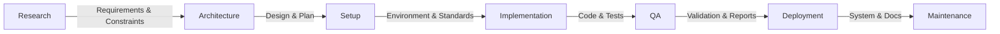

# Phase-Based Workflow Templates with Clear Transition Gates

## 🎯 Core Principle: Input → Process → Output → Next Phase Input

Each phase has **mandatory deliverables** that become **required inputs** for the next phase. You cannot proceed without completing these gates.

---

## 📋 Master Phase Flow



---

## 🔍 Phase 1: Research & Discovery

### 📥 REQUIRED INPUTS
```yaml
inputs:
  - problem_statement: "Clear description of what needs to be solved"
  - initial_requirements: "Basic list of what's needed"
  - constraints: "Known limitations (time, budget, tech)"
  - stakeholders: "Who needs to be involved"
```

### 📋 TEMPLATE: Research Execution

```markdown
# Research Phase Checklist

## 1. Problem Analysis
- [ ] Document the core problem
- [ ] Identify root causes
- [ ] Define success criteria
- [ ] List assumptions

## 2. Solution Research
- [ ] Research existing solutions
- [ ] Evaluate technologies/frameworks
- [ ] Analyze competitors/alternatives
- [ ] Document pros/cons

## 3. Feasibility Study
- [ ] Technical feasibility
- [ ] Resource requirements
- [ ] Timeline estimates
- [ ] Risk assessment

## 4. Stakeholder Input
- [ ] Interview stakeholders
- [ ] Gather requirements
- [ ] Validate understanding
- [ ] Get priority rankings
```

### 📤 REQUIRED OUTPUTS → Architecture Inputs

```yaml
outputs:
  requirements_doc:
    template: |
      # Requirements Document
      
      ## Functional Requirements
      1. [REQ-001] System must...
      2. [REQ-002] Users should be able to...
      
      ## Non-Functional Requirements
      1. [NFR-001] Performance: Response time < 2s
      2. [NFR-002] Security: OAuth2 authentication
      
      ## Constraints
      1. Must integrate with existing X system
      2. Budget limit: $X
      3. Timeline: X weeks
      
      ## Success Criteria
      1. Metric 1: X
      2. Metric 2: Y
  
  technology_assessment:
    template: |
      # Technology Assessment
      
      ## Recommended Stack
      - Frontend: [Framework] because...
      - Backend: [Language/Framework] because...
      - Database: [Type/Product] because...
      
      ## Alternatives Considered
      | Option | Pros | Cons | Decision |
      |--------|------|------|----------|
      | A      | ... | ... | Rejected |
      | B      | ... | ... | Selected |
  
  risk_matrix:
    template: |
      # Risk Assessment
      
      | Risk | Probability | Impact | Mitigation |
      |------|------------|--------|------------|
      | [Risk 1] | High | High | [Strategy] |
```

### ✅ GATE CHECKLIST: Can we proceed to Architecture?
- [ ] Requirements document signed off by stakeholders
- [ ] Technology recommendations approved
- [ ] Budget and timeline confirmed
- [ ] All major risks have mitigation strategies
- [ ] Success criteria are measurable

---

## 🏗️ Phase 2: Architecture & Planning

### 📥 REQUIRED INPUTS (from Research)
```yaml
inputs:
  - requirements_doc: "Complete functional/non-functional requirements"
  - technology_assessment: "Approved technology stack"
  - risk_matrix: "Identified risks with mitigations"
  - constraints: "Technical, time, and resource constraints"
```

### 📋 TEMPLATE: Architecture Design

```markdown
# Architecture Phase Checklist

## 1. System Design
- [ ] Create high-level architecture diagram
- [ ] Define component boundaries
- [ ] Design data flow
- [ ] Plan integration points

## 2. Detailed Design
- [ ] API specifications
- [ ] Database schema
- [ ] Security architecture
- [ ] Infrastructure design

## 3. Implementation Planning
- [ ] Break down into epics/stories
- [ ] Estimate effort
- [ ] Identify dependencies
- [ ] Create timeline

## 4. Quality Planning
- [ ] Define test strategy
- [ ] Set quality gates
- [ ] Plan monitoring
- [ ] Define metrics
```

### 📤 REQUIRED OUTPUTS → Setup Inputs

```yaml
outputs:
  architecture_doc:
    template: |
      # System Architecture
      
      ## Overview
      [Architecture diagram]
      
      ## Components
      ### Component A
      - Purpose: ...
      - Technology: ...
      - Interfaces: ...
      - Dependencies: ...
      
      ## Data Architecture
      ### Data Model
      [ERD or schema diagram]
      
      ### Data Flow
      1. User submits X → API → Database
      2. System processes Y → Queue → Worker
      
      ## Integration Architecture
      ### External Systems
      - System X: REST API, OAuth2
      - System Y: Message Queue, AMQP
      
      ## Security Architecture
      - Authentication: [Method]
      - Authorization: [Model]
      - Encryption: [Standards]
  
  implementation_plan:
    template: |
      # Implementation Plan
      
      ## Phase 1: Foundation (Week 1-2)
      - [ ] Setup development environment
      - [ ] Create project structure
      - [ ] Implement authentication
      
      ## Phase 2: Core Features (Week 3-5)
      - [ ] Feature A: [Description]
      - [ ] Feature B: [Description]
      
      ## Dependencies
      - Feature B depends on Feature A
      - Integration X requires external team
  
  test_strategy:
    template: |
      # Test Strategy
      
      ## Test Levels
      1. Unit Tests: 80% coverage minimum
      2. Integration Tests: All APIs
      3. E2E Tests: Critical user flows
      
      ## Test Environments
      - Dev: Continuous testing
      - Staging: Pre-production validation
      - Prod: Smoke tests only
```

### ✅ GATE CHECKLIST: Can we proceed to Setup?
- [ ] Architecture reviewed and approved by tech lead
- [ ] All components have clear interfaces defined
- [ ] Implementation plan has realistic timelines
- [ ] Test strategy covers all critical paths
- [ ] No unresolved architectural risks

---

## 🛠️ Phase 3: Development Setup

### 📥 REQUIRED INPUTS (from Architecture)
```yaml
inputs:
  - architecture_doc: "Approved system design"
  - implementation_plan: "Development phases and timeline"
  - test_strategy: "Testing approach and requirements"
  - technology_stack: "Specific versions and configurations"
```

### 📋 TEMPLATE: Environment Setup

```markdown
# Setup Phase Checklist

## 1. Repository Setup
- [ ] Create repository structure
- [ ] Setup branching strategy
- [ ] Configure .gitignore
- [ ] Add README and docs

## 2. Development Environment
- [ ] Create Docker/container setup
- [ ] Configure IDE settings
- [ ] Setup local database
- [ ] Install dependencies

## 3. CI/CD Pipeline
- [ ] Setup build pipeline
- [ ] Configure automated tests
- [ ] Setup deployment stages
- [ ] Configure notifications

## 4. Standards & Tools
- [ ] Define coding standards
- [ ] Setup linters/formatters
- [ ] Configure pre-commit hooks
- [ ] Create PR template
```

### 📤 REQUIRED OUTPUTS → Implementation Inputs

```yaml
outputs:
  dev_environment:
    template: |
      # Development Environment
      
      ## Quick Start
      ```bash
      git clone [repo]
      cd [project]
      docker-compose up
      npm install
      npm run dev
      ```
      
      ## Configuration
      - Copy .env.example to .env
      - Set DATABASE_URL
      - Set API_KEY
  
  ci_cd_config:
    template: |
      # CI/CD Configuration
      
      ## Pipeline Stages
      1. Build: Compile and package
      2. Test: Unit, integration, lint
      3. Security: Vulnerability scan
      4. Deploy: To appropriate environment
      
      ## Quality Gates
      - Code coverage > 80%
      - No critical vulnerabilities
      - All tests passing
      - Build time < 5 minutes
  
  coding_standards:
    template: |
      # Development Standards
      
      ## Code Style
      - Language: [Style guide link]
      - Formatting: [Tool configuration]
      
      ## Git Workflow
      - Branch naming: feature/[ticket-id]-description
      - Commit format: type(scope): message
      - PR requires 2 approvals
      
      ## Documentation
      - All public methods must have comments
      - README for each module
      - API documentation required
```

### ✅ GATE CHECKLIST: Can we proceed to Implementation?
- [ ] All developers can run the project locally
- [ ] CI/CD pipeline successfully runs
- [ ] Coding standards are documented and enforced
- [ ] Base project structure matches architecture
- [ ] Development team is trained on tools/process

---

## 💻 Phase 4: Implementation

### 📥 REQUIRED INPUTS (from Setup)
```yaml
inputs:
  - working_environment: "All devs can build and run"
  - ci_cd_pipeline: "Automated testing in place"
  - coding_standards: "Clear development guidelines"
  - implementation_plan: "Prioritized feature list"
```

### 📋 TEMPLATE: Feature Development

```markdown
# Implementation Phase Checklist

## For Each Feature:
- [ ] Create feature branch
- [ ] Write unit tests first (TDD)
- [ ] Implement functionality
- [ ] Ensure tests pass
- [ ] Document code
- [ ] Create/update API docs
- [ ] Submit PR
- [ ] Address review feedback
- [ ] Merge to main

## Daily Practices:
- [ ] Daily standup
- [ ] Update task board
- [ ] Resolve blockers
- [ ] Code reviews

## Weekly Practices:
- [ ] Sprint planning
- [ ] Retrospective
- [ ] Dependency check
- [ ] Progress report
```

### 📤 REQUIRED OUTPUTS → Testing Inputs

```yaml
outputs:
  feature_completion:
    template: |
      # Feature: [Name]
      
      ## Implementation Details
      - Branch: feature/[id]-[name]
      - PR: #[number]
      - Tests: [X unit, Y integration]
      
      ## Acceptance Criteria Met
      - [x] Criteria 1
      - [x] Criteria 2
      
      ## Documentation
      - API Docs: [link]
      - User Guide: [link]
  
  test_coverage:
    template: |
      # Test Coverage Report
      
      ## Overall Coverage: X%
      
      | Module | Coverage | Critical Paths |
      |--------|----------|----------------|
      | Auth   | 95%      | ✓ All covered  |
      | API    | 87%      | ✓ All covered  |
  
  integration_status:
    template: |
      # Integration Status
      
      ## Internal APIs
      - [x] Service A ↔ Service B
      - [x] Service B ↔ Database
      
      ## External APIs
      - [x] Payment Gateway: Tested
      - [x] Email Service: Tested
```

### ✅ GATE CHECKLIST: Can we proceed to Testing?
- [ ] All planned features implemented
- [ ] Code coverage meets minimum (80%)
- [ ] No outstanding PR comments
- [ ] API documentation complete
- [ ] Integration points tested
- [ ] No critical technical debt

---

## 🧪 Phase 5: Testing & QA

### 📥 REQUIRED INPUTS (from Implementation)
```yaml
inputs:
  - completed_features: "All code merged to main"
  - test_coverage_report: "Unit test coverage data"
  - integration_status: "All integrations verified"
  - test_strategy_doc: "From architecture phase"
```

### 📋 TEMPLATE: QA Execution

```markdown
# QA Phase Checklist

## 1. Functional Testing
- [ ] Execute test cases
- [ ] Verify acceptance criteria
- [ ] Test edge cases
- [ ] Cross-browser testing

## 2. Non-Functional Testing
- [ ] Performance testing
- [ ] Security testing
- [ ] Accessibility testing
- [ ] Load testing

## 3. User Acceptance Testing
- [ ] UAT environment setup
- [ ] User training
- [ ] Feedback collection
- [ ] Issue resolution

## 4. Regression Testing
- [ ] Full regression suite
- [ ] Automated test results
- [ ] Manual verification
- [ ] Sign-off obtained
```

### 📤 REQUIRED OUTPUTS → Deployment Inputs

```yaml
outputs:
  test_results:
    template: |
      # Test Results Summary
      
      ## Test Execution
      - Total Test Cases: X
      - Passed: X (Y%)
      - Failed: 0
      - Blocked: 0
      
      ## Defect Summary
      | Severity | Found | Fixed | Open |
      |----------|-------|-------|------|
      | Critical | 0     | 0     | 0    |
      | Major    | 3     | 3     | 0    |
      | Minor    | 5     | 3     | 2    |
      
      ## Sign-offs
      - QA Lead: ✓ [Date]
      - Product Owner: ✓ [Date]
      - Tech Lead: ✓ [Date]
  
  performance_report:
    template: |
      # Performance Test Results
      
      ## Response Times
      | Endpoint | Target | Actual | Status |
      |----------|--------|--------|---------|
      | API /users | <200ms | 150ms | ✓ Pass |
      
      ## Load Test Results
      - Concurrent Users: 1000
      - Response Time: P95 < 500ms
      - Error Rate: < 0.1%
      - CPU Usage: < 70%
  
  security_assessment:
    template: |
      # Security Assessment
      
      ## Vulnerability Scan
      - Critical: 0
      - High: 0
      - Medium: 2 (resolved)
      - Low: 5 (accepted)
      
      ## Compliance
      - [x] OWASP Top 10 checked
      - [x] Data encryption verified
      - [x] Authentication tested
      - [x] Authorization validated
```

### ✅ GATE CHECKLIST: Can we proceed to Deployment?
- [ ] Zero critical/major defects
- [ ] Performance targets met
- [ ] Security scan passed
- [ ] UAT sign-off received
- [ ] Regression tests passed
- [ ] Deployment guide prepared

---

## 🚀 Phase 6: Deployment

### 📥 REQUIRED INPUTS (from Testing)
```yaml
inputs:
  - test_sign_off: "All test results approved"
  - deployment_package: "Built and tested artifacts"
  - deployment_guide: "Step-by-step instructions"
  - rollback_plan: "Recovery procedures"
```

### 📋 TEMPLATE: Deployment Execution

```markdown
# Deployment Phase Checklist

## Pre-Deployment
- [ ] Backup production data
- [ ] Notify stakeholders
- [ ] Prepare monitoring
- [ ] Review rollback plan

## Deployment Steps
- [ ] Deploy to staging
- [ ] Smoke test staging
- [ ] Deploy to production
- [ ] Smoke test production
- [ ] Monitor metrics
- [ ] Verify functionality

## Post-Deployment
- [ ] Update documentation
- [ ] Notify users
- [ ] Monitor for 24h
- [ ] Conduct retrospective
```

### 📤 REQUIRED OUTPUTS → Maintenance Inputs

```yaml
outputs:
  deployment_report:
    template: |
      # Deployment Report
      
      ## Deployment Details
      - Date/Time: [timestamp]
      - Version: X.Y.Z
      - Duration: X minutes
      - Issues: None/[list]
      
      ## Verification
      - [x] All services running
      - [x] Health checks passing
      - [x] Smoke tests passed
      - [x] Performance normal
  
  operational_docs:
    template: |
      # Operations Guide
      
      ## System Access
      - Production URL: [url]
      - Admin Panel: [url]
      - Monitoring: [url]
      
      ## Common Operations
      ### Restart Service
      ```bash
      kubectl rollout restart deployment/[name]
      ```
      
      ### Check Logs
      ```bash
      kubectl logs -f deployment/[name]
      ```
  
  support_package:
    template: |
      # Support Documentation
      
      ## Known Issues
      | Issue | Workaround | Fix ETA |
      |-------|------------|---------|
      | [Issue] | [Steps] | [Date] |
      
      ## FAQs
      Q: How do I...?
      A: [Answer]
      
      ## Escalation Path
      1. L1 Support: [contact]
      2. L2 Support: [contact]
      3. Dev Team: [contact]
```

### ✅ GATE CHECKLIST: Can we proceed to Maintenance?
- [ ] System stable for 24 hours
- [ ] All documentation published
- [ ] Support team trained
- [ ] Monitoring alerts configured
- [ ] Backup procedures tested
- [ ] Users successfully onboarded

---

## 🔧 Phase 7: Maintenance & Operations

### 📥 REQUIRED INPUTS (from Deployment)
```yaml
inputs:
  - operational_system: "Running in production"
  - support_documentation: "Complete ops guide"
  - monitoring_setup: "Alerts configured"
  - support_team: "Trained and ready"
```

### 📋 TEMPLATE: Ongoing Operations

```markdown
# Maintenance Phase Activities

## Daily Tasks
- [ ] Check system health
- [ ] Review error logs
- [ ] Monitor performance
- [ ] Address tickets

## Weekly Tasks
- [ ] Performance review
- [ ] Capacity planning
- [ ] Security patches
- [ ] Backup verification

## Monthly Tasks
- [ ] Full system audit
- [ ] Update documentation
- [ ] Review SLAs
- [ ] Plan improvements
```

### 📤 ONGOING OUTPUTS

```yaml
outputs:
  monthly_report:
    template: |
      # Monthly Operations Report
      
      ## System Metrics
      - Uptime: 99.9%
      - Avg Response Time: Xms
      - Error Rate: X%
      - User Satisfaction: X/5
      
      ## Incidents
      | Date | Issue | Impact | Resolution |
      |------|-------|--------|------------|
      
      ## Improvements
      - Implemented: [list]
      - Planned: [list]
```

---

## 🔄 Phase Transition Decision Framework

### For EVERY Phase Transition:

```markdown
# Phase Transition Checklist

## 1. Review Required Outputs
- [ ] All templates completed
- [ ] All data gathered
- [ ] All documents reviewed

## 2. Validate Quality
- [ ] Outputs meet standards
- [ ] No critical gaps
- [ ] Risks acceptable

## 3. Obtain Approvals
- [ ] Technical approval
- [ ] Business approval
- [ ] Resource confirmation

## 4. Prepare Handoff
- [ ] Next team briefed
- [ ] Resources transferred
- [ ] Questions answered

## 5. Make Go/No-Go Decision
GO Criteria:
- All checkboxes checked
- All approvals obtained
- Next phase team ready

NO-GO Criteria:
- Missing critical outputs
- Unacceptable risks
- Resources not available
```

---

## 📊 Quick Reference: Phase Dependencies

| Phase | Key Inputs Needed | Key Outputs Produced | Cannot Start Without |
|-------|-------------------|---------------------|---------------------|
| Research | Problem statement | Requirements, Tech stack | Clear problem |
| Architecture | Requirements, Tech stack | Design, Plan | Approved requirements |
| Setup | Design, Plan | Environment, Pipeline | Approved architecture |
| Implementation | Environment, Standards | Code, Tests | Working environment |
| Testing | Code, Test strategy | Test results, Reports | Completed features |
| Deployment | Test approval, Package | Live system, Docs | Passed testing |
| Maintenance | Live system, Docs | Metrics, Improvements | Successful deployment |

---

## 💡 Using These Templates

1. **At Phase Start**: Copy the relevant template section
2. **During Phase**: Fill in templates as you work
3. **Before Transition**: Complete all required outputs
4. **At Gate Review**: Use transition checklist
5. **After Approval**: Hand off outputs to next phase

Remember: **You cannot skip outputs** - they are required inputs for the next phase!