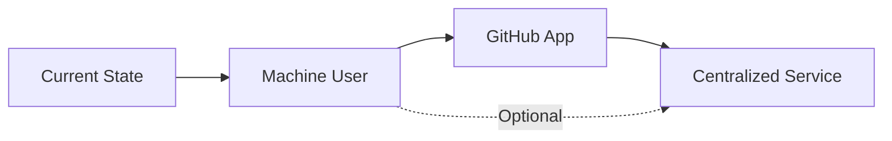

# GitHub Workflow Automation Alternatives: Comprehensive Synthesis Report

## Executive Summary

This report synthesizes the analysis of three alternative approaches for GitHub workflow automation:
1. **Machine User (Bot Account)**
2. **GitHub App** 
3. **Centralized Service**

Each approach offers distinct advantages and trade-offs in terms of implementation complexity, maintenance burden, and scalability.

## Comparative Analysis Matrix

| Criteria | Machine User | GitHub App | Centralized Service |
|----------|--------------|------------|-------------------|
| **Setup Complexity** | ⭐⭐⭐⭐⭐ Simple | ⭐⭐⭐ Moderate | ⭐⭐ Complex |
| **Identity Clarity** | ⭐⭐⭐⭐ Good | ⭐⭐⭐⭐⭐ Excellent | ⭐⭐⭐⭐⭐ Excellent |
| **Permission Control** | ⭐⭐⭐ Basic | ⭐⭐⭐⭐⭐ Fine-grained | ⭐⭐⭐⭐⭐ Fine-grained |
| **Scalability** | ⭐⭐ Limited | ⭐⭐⭐⭐ Good | ⭐⭐⭐⭐⭐ Excellent |
| **Maintenance** | ⭐⭐⭐⭐ Low | ⭐⭐⭐ Moderate | ⭐⭐ High |
| **Multi-repo Support** | ⭐⭐ Manual | ⭐⭐⭐⭐ Built-in | ⭐⭐⭐⭐⭐ Native |
| **Cost** | Free | Free | Variable |
| **Time to Deploy** | 30 minutes | 2-3 hours | 1-2 days |

## Detailed Alternative Analysis

### 1. Machine User (Bot Account)

**Overview**: Create a dedicated GitHub account specifically for automation tasks.

**Implementation Details**:
```bash
# Simple environment change
export GITHUB_TOKEN="ghp_bot_token_here"
# No code changes required
```

**Advantages**:
- ✅ Immediate implementation (30 minutes)
- ✅ Zero code changes required
- ✅ Clear separation from personal account
- ✅ Easy to understand and manage
- ✅ Works with existing codebase

**Disadvantages**:
- ❌ Requires separate email/account management
- ❌ Uses personal access tokens (less secure)
- ❌ Manual setup for each repository
- ❌ Limited to one identity across all repos

**Best For**: Quick solution for single repository with minimal maintenance needs.

### 2. GitHub App

**Overview**: Create a GitHub App with dedicated bot identity and fine-grained permissions.

**Implementation Details**:
```javascript
// Code modification required
const { createAppAuth } = require("@octokit/auth-app");

const auth = createAppAuth({
  appId: process.env.GITHUB_APP_ID,
  privateKey: fs.readFileSync(process.env.GITHUB_APP_PRIVATE_KEY_PATH, 'utf8'),
  installationId: process.env.GITHUB_APP_INSTALLATION_ID,
});

const octokit = new Octokit({
  auth: await auth({ type: "installation" })
});
```

**Advantages**:
- ✅ Professional appearance (`automation[bot]`)
- ✅ Fine-grained permissions
- ✅ Built-in rate limit advantages
- ✅ Secure authentication (private key)
- ✅ Audit trail and insights

**Disadvantages**:
- ❌ More complex setup process
- ❌ Requires private key management
- ❌ Code changes needed
- ❌ Still per-repository installation

**Best For**: Professional automation for multiple repositories within single organization.

### 3. Centralized Service

**Overview**: Transform automation into a multi-tenant service supporting multiple repositories.

**Architecture**:
```
┌─────────────────────────────────────┐
│     Central Automation Service      │
├─────────────────────────────────────┤
│ • Multi-repo monitoring             │
│ • Shared ruv-swarm coordination     │
│ • Analytics dashboard               │
│ • Template management               │
└─────────────────────────────────────┘
              │
    ┌─────────┼─────────┐
    ▼         ▼         ▼
  Repo A    Repo B    Repo C
```

**Implementation Phases**:
1. **Phase 1**: Multi-repository support (1 week)
2. **Phase 2**: GitHub App marketplace (2 weeks)
3. **Phase 3**: Web dashboard & analytics (1 month)

**Advantages**:
- ✅ Ultimate scalability
- ✅ Single point of management
- ✅ Cross-project intelligence
- ✅ Professional service offering
- ✅ Monetization potential

**Disadvantages**:
- ❌ Significant development effort
- ❌ Hosting infrastructure needed
- ❌ Complex architecture
- ❌ Ongoing maintenance burden

**Best For**: Long-term vision with multiple projects or service offering.

## Implementation Recommendations

### Immediate Need (This Week)
**Recommended: Machine User**
- Create `dug-21-bot` account
- Generate personal access token
- Update environment variables
- Zero code changes required

### Short-term Growth (This Month)
**Recommended: GitHub App**
- Better security model
- Professional appearance
- Moderate implementation effort
- Future-proof for growth

### Long-term Vision (3+ Months)
**Recommended: Centralized Service**
- If managing multiple repositories
- If considering service offering
- If cross-project analytics valuable
- Requires dedicated development effort

## Risk Analysis

### Machine User Risks
- Token expiration management
- Account security (2FA required)
- Manual permission management

### GitHub App Risks
- Private key security
- Installation management
- API version changes

### Centralized Service Risks
- Infrastructure costs
- Maintenance burden
- Complexity overhead
- Uptime requirements

## Migration Path



Each step builds upon the previous, allowing incremental improvement:
1. Start with Machine User (immediate fix)
2. Upgrade to GitHub App (when ready)
3. Evolve to Centralized Service (if needed)

## Final Recommendation

**For immediate needs**: Implement the **Machine User** approach. It provides instant identity separation with zero code changes and can be completed in under an hour.

**Next evolution**: Plan migration to **GitHub App** within 2-4 weeks for better security and professional appearance.

**Future consideration**: Evaluate **Centralized Service** only if:
- Managing 5+ repositories
- Need cross-project coordination
- Considering commercialization
- Have dedicated maintenance resources

## Implementation Checklist

### Machine User (Recommended First Step)
- [ ] Create new GitHub account for bot
- [ ] Verify email address
- [ ] Add bot as repository collaborator
- [ ] Generate personal access token
- [ ] Update environment variables
- [ ] Test automation with new identity
- [ ] Document bot account details

### Future GitHub App (When Ready)
- [ ] Create GitHub App
- [ ] Configure permissions
- [ ] Generate private key
- [ ] Install on repository
- [ ] Update authentication code
- [ ] Test all workflows
- [ ] Deprecate machine user

## Conclusion

The three alternatives represent a progression from simple to sophisticated. The Machine User approach offers immediate relief from the identity confusion problem, while GitHub App and Centralized Service provide paths for growth. Starting with the simplest solution and evolving based on actual needs minimizes risk and development overhead while maintaining flexibility for future expansion.

---

*Report compiled by Research Coordinator Agent*  
*Synthesis of multi-agent analysis on GitHub workflow automation alternatives*