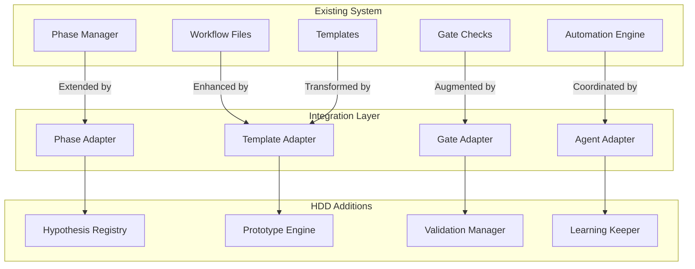

# HDD Integration Points Specification

## Overview

This document specifies how HDD integrates with the existing GitHub workflow system, identifying specific touchpoints and modification strategies.

## Integration Architecture



## File System Integration

### Existing Structure Enhancement

```yaml
# Current structure
.devcontainer/github-workflow/
  ├── issues/              # Keep as-is
  ├── templates/           # Enhance with HDD
  ├── automation.js        # Extend with HDD hooks
  └── monitor.js          # Add HDD metrics

# New HDD additions
.devcontainer/github-workflow/
  └── templates/
      └── hdd/
          ├── architecture/    # System design docs
          ├── hypotheses/      # Hypothesis templates
          ├── prototypes/      # Prototype patterns
          ├── validations/     # Validation frameworks
          └── learnings/       # Knowledge base
```

### Configuration Integration

```javascript
// config-hdd.json - Extends existing config.json
{
  "extends": "./config.json",
  "hdd": {
    "enabled": true,
    "mode": "hybrid",  // hybrid | pure | migration
    "phases": {
      "discovery": {
        "maxDays": 2,
        "requiredOutputs": ["hypothesis", "metrics", "prototype-plan"],
        "agents": ["researcher", "analyst", "hypothesis-generator"]
      },
      "prototype": {
        "maxDays": 3,
        "requiredOutputs": ["working-code", "basic-tests", "metrics-instrumentation"],
        "agents": ["architect", "coder", "tester"]
      },
      "validation": {
        "maxDays": 2,
        "requiredOutputs": ["metrics-report", "decision", "learnings"],
        "agents": ["validator", "analyst", "documenter"]
      },
      "evolution": {
        "maxDays": 3,
        "requiredOutputs": ["optimized-code", "full-tests", "deployment-ready"],
        "agents": ["optimizer", "refactorer", "deployer"]
      }
    },
    "gates": {
      "hypothesis-validation": {
        "criteria": ["testable", "measurable", "time-bound"],
        "fallback": "traditional-requirements"
      },
      "prototype-readiness": {
        "criteria": ["compiles", "basic-functionality", "instrumented"],
        "fallback": "traditional-design"
      },
      "validation-success": {
        "criteria": ["metrics-positive", "hypothesis-confirmed", "learnings-captured"],
        "fallback": "traditional-testing"
      }
    },
    "metrics": {
      "collection": {
        "automatic": true,
        "points": ["code-generation", "test-execution", "validation", "deployment"],
        "storage": "memory"
      },
      "dashboards": {
        "enabled": true,
        "refresh": "real-time"
      }
    },
    "learning": {
      "automatic": true,
      "storage": "persistent",
      "sharing": "team-wide"
    }
  }
}
```

## Code Integration Points

### 1. Automation Engine Enhancement

```javascript
// automation-hdd.js - Extends automation-enhanced.js
import { BaseAutomation } from './automation-enhanced.js';
import { HDDController } from './hdd/controller.js';

class HDDAutomation extends BaseAutomation {
  constructor(config) {
    super(config);
    this.hdd = new HDDController(config.hdd);
  }
  
  async processIssue(issue) {
    // Check if HDD mode is enabled
    if (this.config.hdd.enabled) {
      // Transform issue into hypothesis
      const hypothesis = await this.hdd.generateHypothesis(issue);
      
      // Create HDD workflow
      const workflow = await this.hdd.createWorkflow(hypothesis);
      
      // Execute with phase mapping
      return await this.executeHDDWorkflow(workflow);
    } else {
      // Fall back to traditional workflow
      return await super.processIssue(issue);
    }
  }
  
  async executeHDDWorkflow(workflow) {
    const phases = ['discovery', 'prototype', 'validation', 'evolution'];
    
    for (const phase of phases) {
      // Execute phase with HDD approach
      const result = await this.executeHDDPhase(phase, workflow);
      
      // Check gate criteria
      if (!await this.checkHDDGate(phase, result)) {
        // Handle gate failure
        return await this.handleGateFailure(phase, result);
      }
      
      // Capture learnings
      await this.captureLearnings(phase, result);
    }
    
    return workflow;
  }
}
```

### 2. Monitor Enhancement

```javascript
// monitor-hdd.js - Extends monitor-enhanced.js
import { BaseMonitor } from './monitor-enhanced.js';
import { HDDMetrics } from './hdd/metrics.js';

class HDDMonitor extends BaseMonitor {
  constructor(config) {
    super(config);
    this.metrics = new HDDMetrics(config.hdd.metrics);
  }
  
  async checkIssues() {
    const issues = await super.checkIssues();
    
    // Enhance with HDD metrics
    for (const issue of issues) {
      issue.hddMetrics = await this.collectHDDMetrics(issue);
      issue.hypothesisStatus = await this.checkHypothesisStatus(issue);
      issue.validationProgress = await this.getValidationProgress(issue);
    }
    
    return issues;
  }
  
  async collectHDDMetrics(issue) {
    return {
      timeToPrototype: await this.metrics.getTimeToPrototype(issue.number),
      validationCycles: await this.metrics.getValidationCycles(issue.number),
      learningVelocity: await this.metrics.getLearningVelocity(issue.number),
      hypothesisSuccessRate: await this.metrics.getHypothesisSuccessRate()
    };
  }
}
```

### 3. Template System Integration

```javascript
// template-hdd.js - New template generator
export class HDDTemplateGenerator {
  generateHypothesisTemplate(issue) {
    return `# Hypothesis: ${issue.title}

## Problem Statement
${issue.body}

## Hypothesis
We believe that [solution approach]
Will result in [expected outcome]
We will know this is true when [success metrics]

## Success Metrics
- Metric 1: [Specific, measurable metric]
- Metric 2: [Specific, measurable metric]
- Metric 3: [Specific, measurable metric]

## Validation Plan
1. Build: [What we'll prototype]
2. Measure: [What data we'll collect]
3. Learn: [How we'll analyze results]

## Time Box
- Discovery: 2 days
- Prototype: 3 days
- Validation: 2 days
- Evolution: 3 days

## Risk Assessment
| Risk | Mitigation |
|------|------------|
| [Risk 1] | [Mitigation 1] |
| [Risk 2] | [Mitigation 2] |
`;
  }
  
  generatePrototypePlan(hypothesis) {
    return `# Prototype Plan: ${hypothesis.title}

## Scope
### In Scope (MVP)
- [Core feature 1]
- [Core feature 2]

### Out of Scope (Future)
- [Feature for later]
- [Nice to have]

## Technical Approach
\`\`\`yaml
architecture:
  pattern: [e.g., MVC, microservice]
  stack:
    - frontend: [tech]
    - backend: [tech]
    - database: [tech]
\`\`\`

## Instrumentation Points
- Performance: [Where to measure]
- Usage: [What to track]
- Errors: [What to monitor]

## Validation Criteria
- [ ] Prototype demonstrates core hypothesis
- [ ] Metrics collection is working
- [ ] Basic error handling in place
`;
  }
}
```

## API Integration Points

### REST API Extensions

```yaml
# New HDD endpoints
/api/hdd/hypotheses:
  GET: List all hypotheses
  POST: Create new hypothesis
  
/api/hdd/hypotheses/{id}:
  GET: Get hypothesis details
  PUT: Update hypothesis
  DELETE: Archive hypothesis
  
/api/hdd/prototypes:
  GET: List prototypes for hypothesis
  POST: Create new prototype version
  
/api/hdd/validations:
  POST: Submit validation results
  GET: Get validation history
  
/api/hdd/learnings:
  GET: Search learnings database
  POST: Add new learning
```

### GraphQL Schema Extensions

```graphql
# HDD Type Definitions
type Hypothesis {
  id: ID!
  issue: Issue!
  statement: String!
  metrics: [Metric!]!
  status: HypothesisStatus!
  prototypes: [Prototype!]!
  validations: [Validation!]!
  learnings: [Learning!]!
  createdAt: DateTime!
  validatedAt: DateTime
}

type Prototype {
  id: ID!
  hypothesis: Hypothesis!
  version: Int!
  description: String!
  codeUrl: String!
  metrics: [MetricResult!]!
  status: PrototypeStatus!
  createdAt: DateTime!
}

type Validation {
  id: ID!
  prototype: Prototype!
  results: [MetricResult!]!
  decision: ValidationDecision!
  rationale: String!
  nextSteps: String!
  createdAt: DateTime!
}

type Learning {
  id: ID!
  hypothesis: Hypothesis!
  insight: String!
  category: LearningCategory!
  impact: ImpactLevel!
  applicability: String!
  createdAt: DateTime!
}

# Queries
extend type Query {
  hypotheses(status: HypothesisStatus): [Hypothesis!]!
  hypothesis(id: ID!): Hypothesis
  learnings(category: LearningCategory, search: String): [Learning!]!
  validationMetrics(timeframe: TimeFrame!): ValidationMetrics!
}

# Mutations
extend type Mutation {
  createHypothesis(input: HypothesisInput!): Hypothesis!
  updateHypothesis(id: ID!, input: HypothesisUpdateInput!): Hypothesis!
  createPrototype(hypothesisId: ID!, input: PrototypeInput!): Prototype!
  submitValidation(prototypeId: ID!, input: ValidationInput!): Validation!
  recordLearning(hypothesisId: ID!, input: LearningInput!): Learning!
}
```

## Database Integration

### Schema Extensions

```sql
-- Hypothesis tracking
CREATE TABLE hypotheses (
  id UUID PRIMARY KEY,
  issue_id INTEGER REFERENCES issues(id),
  statement TEXT NOT NULL,
  success_criteria JSONB NOT NULL,
  status VARCHAR(50) NOT NULL,
  created_at TIMESTAMP NOT NULL,
  validated_at TIMESTAMP,
  outcome TEXT
);

-- Prototype versions
CREATE TABLE prototypes (
  id UUID PRIMARY KEY,
  hypothesis_id UUID REFERENCES hypotheses(id),
  version INTEGER NOT NULL,
  description TEXT,
  code_path TEXT,
  metrics_config JSONB,
  created_at TIMESTAMP NOT NULL,
  UNIQUE(hypothesis_id, version)
);

-- Validation results
CREATE TABLE validations (
  id UUID PRIMARY KEY,
  prototype_id UUID REFERENCES prototypes(id),
  metrics_results JSONB NOT NULL,
  decision VARCHAR(50) NOT NULL,
  rationale TEXT,
  next_steps TEXT,
  created_at TIMESTAMP NOT NULL
);

-- Learning repository
CREATE TABLE learnings (
  id UUID PRIMARY KEY,
  hypothesis_id UUID REFERENCES hypotheses(id),
  insight TEXT NOT NULL,
  category VARCHAR(50) NOT NULL,
  impact_level VARCHAR(20) NOT NULL,
  tags TEXT[],
  created_at TIMESTAMP NOT NULL
);

-- Metrics time series
CREATE TABLE metrics_data (
  id UUID PRIMARY KEY,
  entity_type VARCHAR(50) NOT NULL,
  entity_id UUID NOT NULL,
  metric_name VARCHAR(100) NOT NULL,
  metric_value DECIMAL,
  metadata JSONB,
  recorded_at TIMESTAMP NOT NULL
);
```

## Webhook Integration

### GitHub Webhook Enhancements

```javascript
// webhook-hdd.js
export function enhanceWebhookHandlers(handlers) {
  // Enhance issue creation to trigger hypothesis generation
  handlers.issues.opened = async (payload) => {
    await originalHandler(payload);
    
    if (shouldUseHDD(payload.issue)) {
      await createHypothesisFromIssue(payload.issue);
    }
  };
  
  // Enhance PR creation to link with prototypes
  handlers.pull_request.opened = async (payload) => {
    await originalHandler(payload);
    
    const hypothesis = await findLinkedHypothesis(payload.pull_request);
    if (hypothesis) {
      await linkPrototypeToPR(hypothesis, payload.pull_request);
    }
  };
  
  // Add HDD-specific comment commands
  handlers.issue_comment.created = async (payload) => {
    const command = parseCommand(payload.comment.body);
    
    switch (command.type) {
      case 'validate':
        await triggerValidation(payload.issue, command.args);
        break;
      case 'hypothesis':
        await updateHypothesis(payload.issue, command.args);
        break;
      case 'learning':
        await recordLearning(payload.issue, command.args);
        break;
      default:
        await originalHandler(payload);
    }
  };
}
```

## Migration Strategy

### Phase 1: Parallel Operation (Weeks 1-2)
- Install HDD components alongside existing system
- Run both workflows in parallel for comparison
- Collect metrics on both approaches

### Phase 2: Gradual Adoption (Weeks 3-4)
- Enable HDD for new issues with specific labels
- Use hybrid mode for complex features
- Maintain traditional flow for maintenance

### Phase 3: Full Integration (Month 2)
- Default to HDD for all new development
- Migrate historical data to learning repository
- Train team on new workflow

### Rollback Plan
```javascript
// Enable quick rollback if needed
if (config.hdd.enabled && emergencyRollbackRequired()) {
  config.hdd.enabled = false;
  config.hdd.mode = 'disabled';
  // Revert to traditional workflow immediately
  await revertToTraditionalWorkflow();
}
```

## Performance Considerations

### Optimization Strategies

```yaml
caching:
  hypothesis_cache:
    ttl: 3600  # 1 hour
    keys: ['hypothesis_id', 'issue_id']
  
  prototype_cache:
    ttl: 86400  # 24 hours
    keys: ['prototype_id', 'version']
  
  metrics_cache:
    ttl: 300  # 5 minutes
    keys: ['metric_type', 'entity_id', 'timeframe']

parallel_processing:
  hypothesis_generation:
    max_concurrent: 5
    timeout: 30s
  
  prototype_building:
    max_concurrent: 3
    timeout: 300s
  
  validation_runs:
    max_concurrent: 10
    timeout: 120s

resource_limits:
  memory_per_hypothesis: 512MB
  cpu_per_prototype: 2 cores
  storage_per_learning: 10MB
```