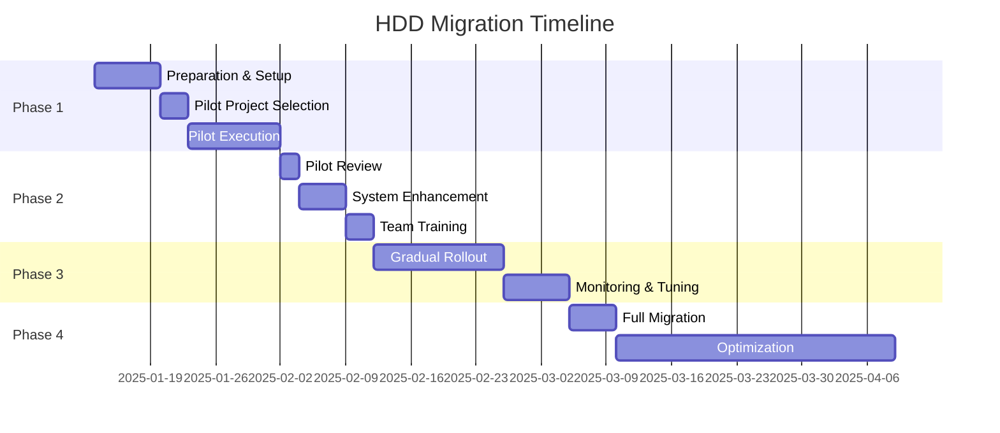
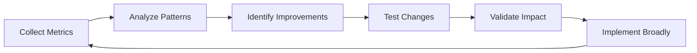

# HDD Migration Plan

## Executive Summary

This plan outlines a phased approach to migrate from the traditional phase-gate workflow to a Hypothesis-Driven Development (HDD) approach, ensuring minimal disruption while maximizing learning and value delivery.

## Migration Timeline



## Phase 1: Foundation (Week 1-2)

### Objectives
- Set up HDD infrastructure alongside existing system
- Select and prepare pilot project
- Establish success metrics

### Tasks

```yaml
week_1:
  technical_setup:
    - [ ] Install HDD components
    - [ ] Configure hybrid mode
    - [ ] Set up monitoring dashboards
    - [ ] Create HDD templates
    - [ ] Test integration points
  
  team_preparation:
    - [ ] Introduce HDD concepts
    - [ ] Select pilot team members
    - [ ] Define success criteria
    - [ ] Create training materials
  
  pilot_selection:
    - [ ] Identify 3-5 candidate features
    - [ ] Assess complexity and risk
    - [ ] Select optimal pilot project
    - [ ] Define hypothesis for pilot

week_2:
  pilot_execution:
    - [ ] Run discovery phase (2 days)
    - [ ] Build prototype (3 days)
    - [ ] Execute validation (2 days)
    - [ ] Iterate in evolution (3 days)
  
  parallel_tracking:
    - [ ] Track traditional metrics
    - [ ] Track HDD metrics
    - [ ] Document differences
    - [ ] Capture learnings
```

### Configuration for Phase 1

```javascript
// config-hdd-phase1.json
{
  "hdd": {
    "enabled": true,
    "mode": "migration",
    "pilotMode": true,
    "phases": {
      "discovery": {
        "enabled": true,
        "duration": { "default": 2, "max": 3 }
      },
      "prototype": {
        "enabled": true,
        "duration": { "default": 3, "max": 5 }
      },
      "validation": {
        "enabled": true,
        "duration": { "default": 2, "max": 3 }
      },
      "evolution": {
        "enabled": true,
        "duration": { "default": 3, "max": 5 }
      }
    },
    "fallback": {
      "enabled": true,
      "trigger": "manual",
      "preserveProgress": true
    }
  }
}
```

### Success Criteria for Phase 1

| Metric | Traditional Baseline | HDD Target | Measurement |
|--------|---------------------|------------|-------------|
| Time to Working Code | 3-4 weeks | < 1 week | Days |
| Time to User Feedback | 6-8 weeks | < 2 weeks | Days |
| Feature Success Rate | 60-70% | > 80% | % shipped |
| Development Joy | Moderate | High | Survey |
| Learning Captured | Minimal | Substantial | Count |

## Phase 2: Enhancement & Training (Week 3-4)

### Objectives
- Incorporate pilot learnings
- Enhance tooling based on feedback
- Train broader team

### Tasks

```yaml
week_3:
  pilot_review:
    - [ ] Analyze pilot metrics
    - [ ] Gather team feedback
    - [ ] Identify pain points
    - [ ] Document best practices
  
  system_enhancement:
    - [ ] Update templates based on learnings
    - [ ] Optimize agent coordination
    - [ ] Improve metric collection
    - [ ] Enhance dashboards
  
  process_refinement:
    - [ ] Adjust phase durations
    - [ ] Refine gate criteria
    - [ ] Update hypothesis templates
    - [ ] Improve validation methods

week_4:
  team_training:
    - [ ] Conduct HDD workshops
    - [ ] Share pilot case study
    - [ ] Practice hypothesis writing
    - [ ] Run simulation exercises
  
  tool_training:
    - [ ] Demo HDD dashboards
    - [ ] Practice with templates
    - [ ] Use agent coordination
    - [ ] Review metrics interpretation
```

### Training Curriculum

```markdown
## HDD Training Program

### Day 1: Concepts & Philosophy
- Traditional vs HDD mindset
- Hypothesis-driven thinking
- Fail fast, learn faster
- Metrics-based decisions

### Day 2: Process & Tools
- HDD workflow walkthrough
- Template usage
- Agent coordination
- Dashboard navigation

### Day 3: Hands-on Practice
- Write real hypotheses
- Build mini-prototypes
- Run validations
- Capture learnings
```

## Phase 3: Gradual Rollout (Week 5-6)

### Objectives
- Expand HDD to more projects
- Build confidence through success
- Refine processes

### Rollout Strategy

```yaml
rollout_waves:
  wave_1:
    scope: "New features only"
    projects: 3-5
    team_size: 50%
    duration: 1 week
    criteria:
      - Small to medium complexity
      - Clear success metrics
      - Willing early adopters
  
  wave_2:
    scope: "All new development"
    projects: All new
    team_size: 100%
    duration: 1 week
    criteria:
      - Include complex features
      - Multiple team coordination
      - Cross-functional work
```

### Monitoring Plan

```javascript
// monitoring-config.js
export const monitoringMetrics = {
  adoption: {
    projectsUsingHDD: 'count',
    teamMembersActive: 'count',
    hypothesesCreated: 'count/week',
    prototypesBuilt: 'count/week'
  },
  
  efficiency: {
    timeToPrototype: 'avg days',
    timeToValidation: 'avg days',
    iterationVelocity: 'features/week',
    reworkReduction: '% decrease'
  },
  
  quality: {
    hypothesisSuccessRate: '%',
    validationAccuracy: '%',
    userSatisfaction: 'score',
    technicalDebt: 'trend'
  },
  
  learning: {
    insightsCaptured: 'count',
    patternsIdentified: 'count',
    processImprovements: 'count',
    knowledgeReuse: 'instances'
  }
};
```

## Phase 4: Full Migration (Month 2+)

### Objectives
- Complete transition to HDD
- Optimize based on data
- Establish continuous improvement

### Final Migration Steps

```yaml
migration_completion:
  technical:
    - [ ] Default all new work to HDD
    - [ ] Archive old templates
    - [ ] Update documentation
    - [ ] Optimize performance
  
  process:
    - [ ] Update team processes
    - [ ] Revise approval workflows
    - [ ] Adjust planning cycles
    - [ ] Modify reporting
  
  cultural:
    - [ ] Celebrate successes
    - [ ] Share learnings broadly
    - [ ] Recognize champions
    - [ ] Embed in culture
```

### Long-term Optimization



## Risk Management

### Identified Risks & Mitigations

| Risk | Probability | Impact | Mitigation Strategy |
|------|-------------|--------|-------------------|
| Team resistance | Medium | High | Gradual rollout, training, success stories |
| Tool complexity | Low | Medium | Simplified interfaces, good documentation |
| Process confusion | Medium | Medium | Clear guides, mentoring, examples |
| Performance impact | Low | Low | Optimization, caching, monitoring |
| Rollback needed | Low | High | Hybrid mode, feature flags, data preservation |

### Rollback Procedures

```javascript
// Emergency rollback procedure
async function rollbackToTraditional() {
  // 1. Disable HDD mode
  await updateConfig({ 
    hdd: { enabled: false },
    workflow: { mode: 'traditional' }
  });
  
  // 2. Preserve HDD data
  await backupHDDData({
    hypotheses: true,
    prototypes: true,
    learnings: true
  });
  
  // 3. Restore traditional workflows
  await restoreTraditionalTemplates();
  await reactivatePhaseGates();
  
  // 4. Notify team
  await notifyTeam({
    message: 'Reverting to traditional workflow',
    reason: getRollbackReason(),
    dataPreserved: true
  });
}
```

## Communication Plan

### Stakeholder Communication

```yaml
communication_timeline:
  before_migration:
    executives:
      message: "Efficiency improvement initiative"
      focus: "ROI and velocity gains"
      frequency: "Monthly updates"
    
    team_leads:
      message: "New development methodology"
      focus: "Process improvements"
      frequency: "Weekly syncs"
    
    developers:
      message: "Faster, data-driven development"
      focus: "Tools and techniques"
      frequency: "Daily standups"
  
  during_migration:
    all_stakeholders:
      updates:
        - Pilot results
        - Metrics improvements
        - Success stories
        - Next steps
      channels:
        - Email newsletters
        - Slack announcements
        - Dashboard displays
        - Team meetings
  
  post_migration:
    success_showcase:
      - Before/after metrics
      - Team testimonials
      - Customer impact
      - Future roadmap
```

### Change Management

```markdown
## Change Management Approach

### 1. Create Urgency
- Share competitive pressures
- Highlight current inefficiencies
- Show potential gains

### 2. Build Coalition
- Identify champions
- Create pilot team
- Showcase early wins

### 3. Form Vision
- Clear HDD benefits
- Tangible outcomes
- Inspiring future state

### 4. Communicate Vision
- Multiple channels
- Consistent messaging
- Regular updates

### 5. Empower Action
- Remove barriers
- Provide tools
- Support experimentation

### 6. Generate Wins
- Celebrate pilots
- Share metrics
- Recognize contributors

### 7. Consolidate Gains
- Expand gradually
- Continuous improvement
- Prevent regression

### 8. Anchor Changes
- Update processes
- Modify evaluations
- Embed in culture
```

## Success Metrics Dashboard

```yaml
dashboard_sections:
  migration_progress:
    widgets:
      - adoption_rate_chart
      - team_readiness_score
      - project_status_grid
      - training_completion
  
  efficiency_gains:
    widgets:
      - time_to_market_trend
      - velocity_comparison
      - cycle_time_reduction
      - throughput_increase
  
  quality_improvements:
    widgets:
      - hypothesis_success_rate
      - validation_accuracy
      - rework_reduction
      - user_satisfaction
  
  learning_growth:
    widgets:
      - insights_captured
      - patterns_discovered
      - knowledge_reuse
      - process_improvements
```

## Post-Migration Review

### 3-Month Checkpoint

```yaml
review_areas:
  quantitative:
    - Development velocity: Target 2x improvement
    - Feature success rate: Target 80%+
    - Time to validation: Target <7 days
    - Learning capture rate: Target 90%+
  
  qualitative:
    - Team satisfaction: Survey
    - Process clarity: Feedback
    - Tool effectiveness: Usage stats
    - Cultural adoption: Observations
  
  adjustments:
    - Fine-tune phase durations
    - Optimize agent strategies
    - Enhance templates
    - Improve training
```

## Conclusion

This migration plan provides a structured path from traditional development to HDD while minimizing risk and maximizing learning. The key to success is gradual adoption, continuous measurement, and willingness to adapt based on feedback.

Remember: The goal is not to abandon all structure, but to make structure serve agility and learning.