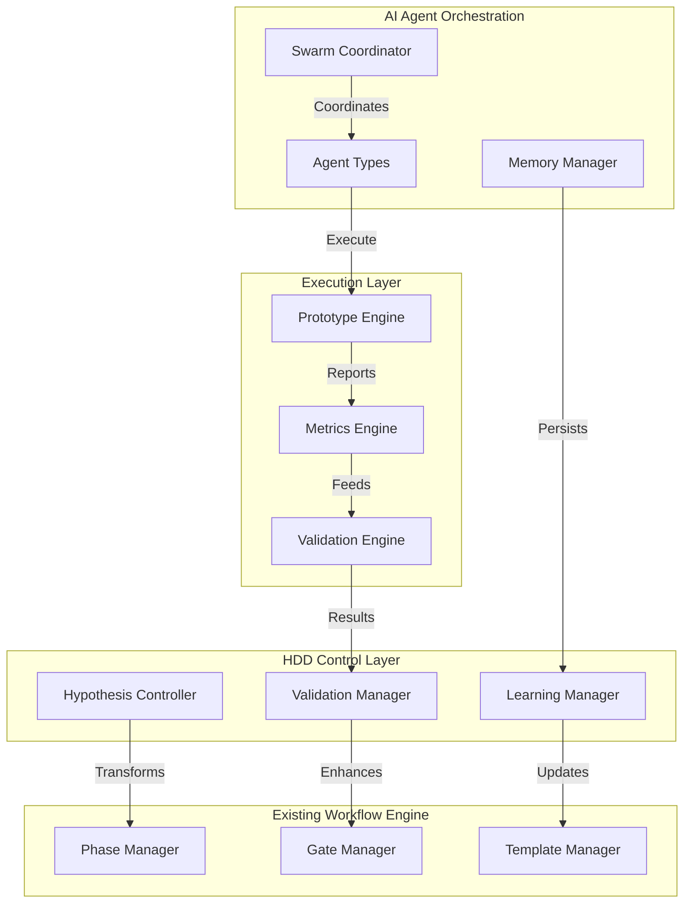
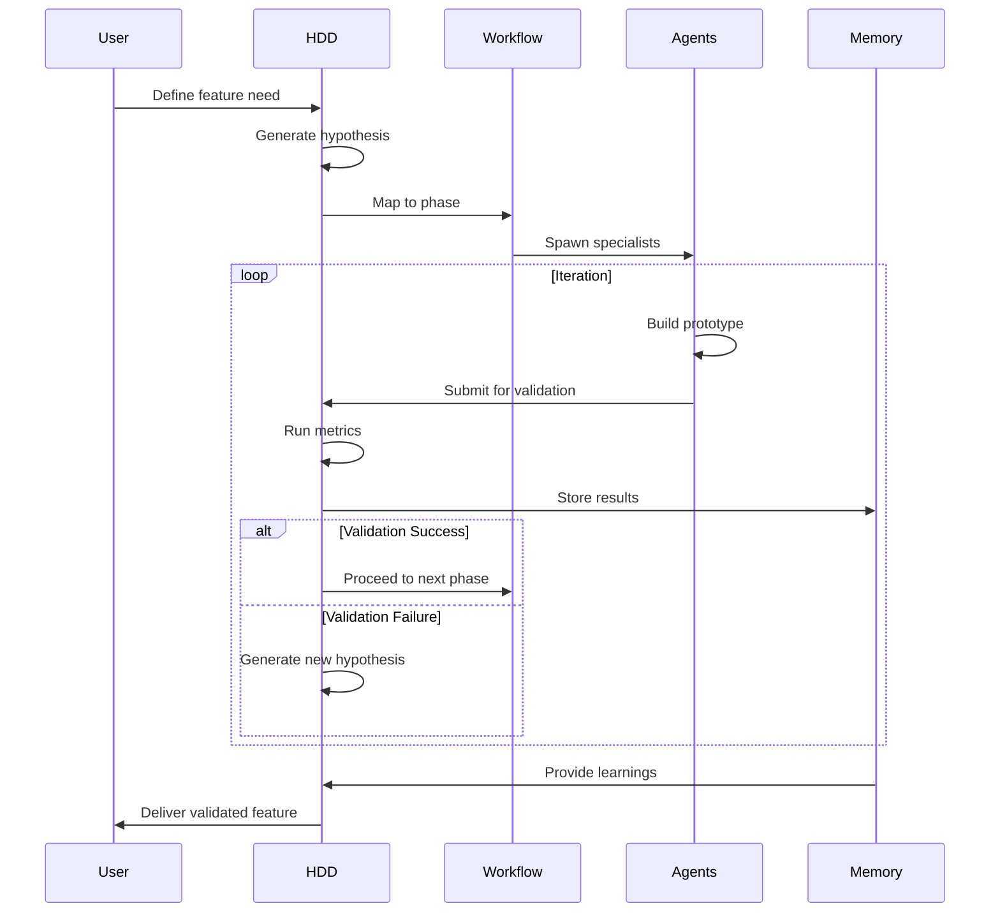
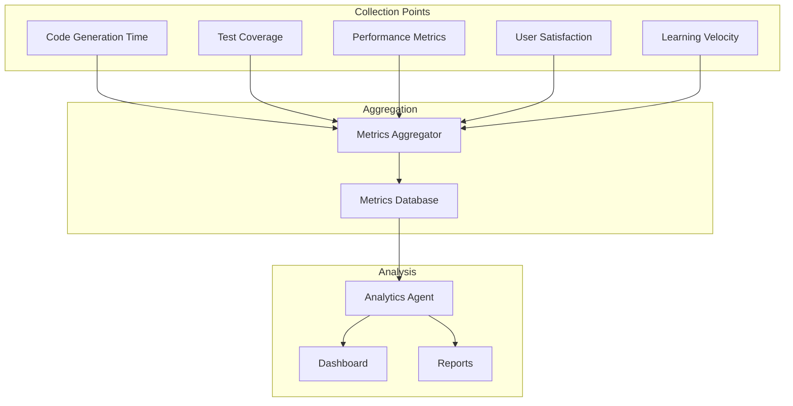

# HDD Integration System Design

## Architecture Overview



## Component Architecture

### 1. HDD Control Layer
Manages the hypothesis-driven flow and integrates with existing phase management.

```yaml
components:
  hypothesis_controller:
    responsibilities:
      - Transform phase requirements into testable hypotheses
      - Track hypothesis lifecycle
      - Coordinate validation timing
    interfaces:
      - input: Phase requirements
      - output: Hypothesis definitions
      - storage: Memory (hypothesis history)
  
  validation_manager:
    responsibilities:
      - Define validation criteria
      - Execute validation protocols
      - Determine go/no-go decisions
    interfaces:
      - input: Hypothesis + prototype
      - output: Validation results
      - triggers: Gate transitions
  
  learning_manager:
    responsibilities:
      - Capture experiment outcomes
      - Update decision patterns
      - Generate insights
    interfaces:
      - input: Validation results
      - output: Learning artifacts
      - storage: Knowledge base
```

### 2. Integration Architecture



### 3. Data Flow Architecture

```yaml
data_flows:
  hypothesis_flow:
    source: User requirements
    transformations:
      - Requirement analysis
      - Hypothesis generation
      - Success criteria definition
    destination: Hypothesis registry
  
  prototype_flow:
    source: Hypothesis registry
    transformations:
      - Code generation
      - Integration assembly
      - Test creation
    destination: Prototype repository
  
  validation_flow:
    source: Prototype repository
    transformations:
      - Metric collection
      - Performance analysis
      - User feedback
    destination: Validation reports
  
  learning_flow:
    source: Validation reports
    transformations:
      - Pattern extraction
      - Success factor analysis
      - Failure root cause
    destination: Knowledge base
```

### 4. AI Agent Coordination Architecture

```mermaid
graph LR
    subgraph "Discovery Phase Agents"
        RA[Research Agent]
        HA[Hypothesis Agent]
        MA[Metrics Agent]
    end
    
    subgraph "Prototype Phase Agents"
        AA[Architect Agent]
        CA[Coder Agent]
        TA[Test Agent]
    end
    
    subgraph "Validation Phase Agents"
        VA[Validator Agent]
        DA[Data Agent]
        FA[Feedback Agent]
    end
    
    subgraph "Evolution Phase Agents"
        OA[Optimizer Agent]
        RA2[Refactor Agent]
        DA2[Deploy Agent]
    end
    
    RA -->|Requirements| HA
    HA -->|Hypothesis| MA
    MA -->|Metrics| AA
    
    AA -->|Design| CA
    CA -->|Code| TA
    TA -->|Tests| VA
    
    VA -->|Results| DA
    DA -->|Analysis| FA
    FA -->|Insights| OA
    
    OA -->|Improvements| RA2
    RA2 -->|Clean Code| DA2
```



## Integration Points

### 1. Phase Mapping

| Traditional Phase | HDD Phase | Key Transformation |
|------------------|-----------|-------------------|
| Research | Discovery | Requirements → Hypotheses |
| Architecture | Discovery/Prototype | Design docs → Working prototypes |
| Implementation | Prototype | Full build → MVP build |
| Testing | Validation | Test suite → Metrics collection |
| Deployment | Evolution | Release → Iterative improvement |
| Maintenance | Evolution | Bug fixes → Continuous learning |

### 2. Gate Transformations

```yaml
traditional_gates:
  research_to_architecture:
    criteria:
      - Requirements documented
      - Stakeholder approval
      - Budget confirmed
    
hdd_gates:
  discovery_to_prototype:
    criteria:
      - Hypothesis testable
      - Success metrics defined
      - Prototype scope clear
      
  prototype_to_validation:
    criteria:
      - Working prototype exists
      - Metrics instrumented
      - Validation plan ready
      
  validation_to_evolution:
    criteria:
      - Metrics collected
      - Success criteria met
      - Learning captured
```

### 3. Template Evolution

```yaml
template_mapping:
  requirements_doc:
    becomes: hypothesis_doc
    additions:
      - Success metrics
      - Validation criteria
      - Learning goals
  
  design_doc:
    becomes: prototype_plan
    additions:
      - MVP scope
      - Iteration strategy
      - Metric collection points
  
  test_plan:
    becomes: validation_plan
    additions:
      - Hypothesis tests
      - Metric thresholds
      - Decision criteria
```

## Metrics Collection Architecture



## Memory Architecture

```yaml
memory_structure:
  hypothesis_store:
    schema:
      id: uuid
      hypothesis: string
      metrics: object
      created: timestamp
      validated: boolean
      outcome: string
      learnings: array
  
  prototype_store:
    schema:
      id: uuid
      hypothesis_id: uuid
      version: integer
      code_path: string
      metrics: object
      created: timestamp
  
  validation_store:
    schema:
      id: uuid
      prototype_id: uuid
      results: object
      decision: string
      timestamp: timestamp
  
  learning_store:
    schema:
      id: uuid
      pattern: string
      success_factors: array
      failure_reasons: array
      recommendations: array
      timestamp: timestamp
```

## Security Considerations

```yaml
security_layers:
  code_generation:
    - Sandbox execution environment
    - Code review requirements
    - Security scanning integration
  
  data_handling:
    - Encryption at rest
    - Access control per phase
    - Audit logging
  
  agent_coordination:
    - Secure communication channels
    - Agent authentication
    - Command validation
```

## Performance Optimization

```yaml
optimization_strategies:
  parallel_execution:
    - Multiple hypotheses simultaneously
    - Parallel prototype development
    - Concurrent validation runs
  
  caching:
    - Hypothesis results cache
    - Prototype component library
    - Validation pattern cache
  
  resource_management:
    - Dynamic agent scaling
    - Memory usage limits
    - Execution timeouts
```